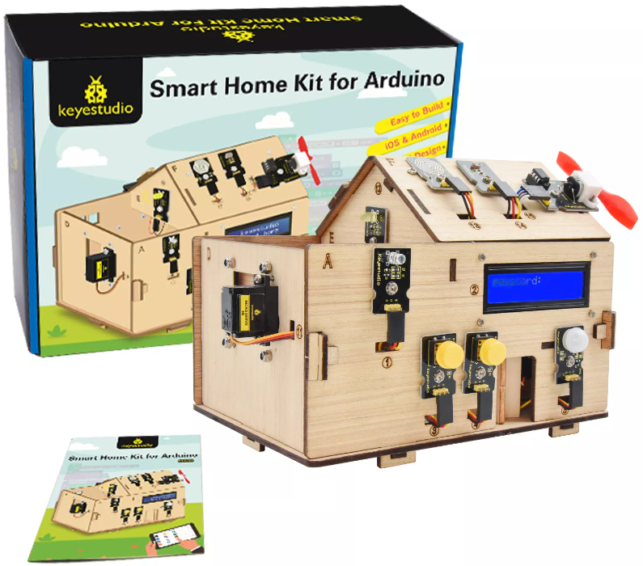
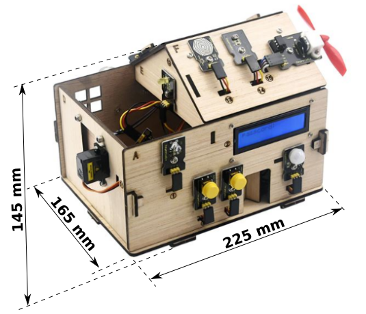
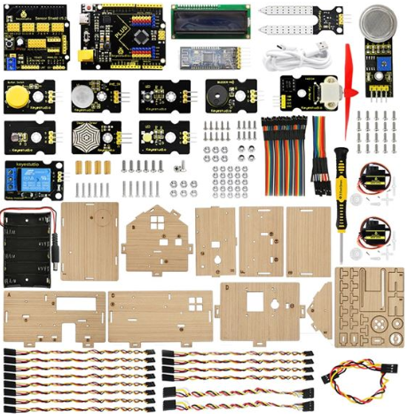
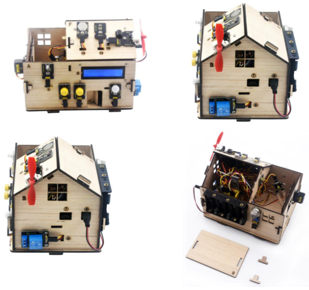

# 2.1. El kit
La idea básica es simular el funcionamiento de una casa inteligente o Smart Home de la vida real, basándose en la programación con Arduino. El kit incluye toda la estructura de la casa, el sistema de control basado en Arduino y múltiples sensores y actuadores para poder realizar diferentes tipos de acciones como, por ejemplo, encender el aire acondicionado y el calentador de agua, abrir la cerradura electrónica de la
puerta y la luz antes de llegar a casa.

En la Figura 2.1.1 vemos el aspecto del kit.

  
*Figura 2.1.1. Aspecto del kit*

En la Figura 2.1.2 podemos ver las dimensiones del kit una vez montado.

  
*Figura 2.1.2. Dimensiones del kit montado*

En la Figura 2.1.3 vemos desplegado todo el material contenido de la caja y que vamos a desglosar en el apartado de ensamblado.

  
*Figura 2.1.3. Todo el contenido del kit*

En la Figura 2.1.4 podemos observar la smart home desde diferentes ángulos.

  
*Figura 2.1.4. Vistas de la smart home*

