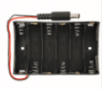
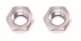

# 2.2. Guía de ensamblado
Comenzamos por verificar que tenemos los tableros etiquetados con las letras A, B, C, D, E, F, G, H e I y la placa con el resto de partes y que están en buen estado. Todos los elementos los vemos en la figura 2.2.1.

  
*Figura 2.2.1. Tableros A a I y partes*

Los cables que utilizaremos en cada apartado son los que describimos seguidamente:

* **Elementos con conector de 3 pines y servos**

| Letra | Función | Descripción | Color del cable | En el servo |
|:-:|:-:|---|:-:|:-:|
| G | Ground | Es el negativo de la alimentación | Negro | Conductor marrón |
| V | VCC | Es el positivo de la alimentación | Rojo | Conductor rojo |
| S | Signal | Es el cable de señal | Amarillo/Naranja | Conductor naranja |

* **Elementos con conector de 4 pines**

| Dispositivo | Letras / Color del cable | Dispositivo | Letras / Color del cable |
|:-:|:-:|:-:|:-:|
| **Sensor de gas MQ-2** | GND - Marrón  VCC - Rojo D0 - Naranja A0 - Amarillo | **Ventilador** | GND - Marrón  VCC - Rojo ENA - Naranja ENB - Amarillo |
| **LCD** | GND - Marrón  VCC - Rojo SDA - Naranja SCL - Amarillo | **Bluetooth** | VCC - Rojo  GND - Marrón Tx - Naranja Rx - Amarillo |

**El módulo bluetooth también se puede conectar directamente en la placa Keyestudio v5.2.**

## **2.2.1. Tablero A**
Preparamos los componentes siguientes:

| Cantidad | Designación | Aspecto |
|:-:|---|:-:| 
| 1 | Tablero A |  |
| 4 | Tornillos de cabeza redonda M3x10mm |  |
| 4 | Tuercas M3 |  |
| 4 | Tornillos de cabeza redonda M2.5x10mm |  |
| 4 | Tuercas M2.5 |  |
| 2 | Módulos botón pulsador |  |
| 1 | LED blanco |  |
| 1 | Sensor de movimiento PIR |  |
| 1 | Pantalla LCD1602 |  |
| 1 | Cable tipo dupont H-H de 4 pines |  |
| 4 | Cable tipo dupont H-H de 3 pines |  |

En la Figura 2.2.2 vemos el conjunto de materiales desplegado para tenerlo todo a mano para comenzar el montaje.

  
*Figura 2.2.2. Tablero A y todos los componentes*

Fijamos al tablero el LED blanco, los dos sensores tipo botón y el sensor de presencia PIR utilizando los 4 tornillos M3x10mm y las 4 tuercas M3. Instalamos en su posición la pantalla LCD1602 utilizando los 4 tornillos M2.5x10mm y las 4 tuercas M2.5. En la Figura 2.2.3 vemos el aspecto del tablero A en este momento.

  
*Figura 2.2.3. Tablero A con los componentes montados*

Conectamos los 4 cables tipo dupont de 3 pines teniendo la precaución de que queden orientados para que coincidan las letras en cada extremo y pasamos el extremo contrario por la ranura que hay debajo. Conectamos el cable tipo dupont de 4 pines.

## **2.2.2. Tablero B**
Preparamos los componentes siguientes:

| Cantidad | Designación | Aspecto |
|:-:|---|:-:|
| 1 | Tablero B |  |
| 2 | Tornillos de cabeza redonda M3x10mm |  |
| 2 | Tuercas M3 |  |
| 1 | Módulo relé |  |
| 1 | Cable tipo dupont H-H de 3 pines |  |

En la Figura 2.2.4 vemos el conjunto de materiales desplegado para tenerlo todo a mano para comenzar el montaje.

  
*Figura 2.2.4. Tablero B y todos los componentes*

Ensamblamos el módulo relé en el tablero con los 2 tornillos M3x10mm y las 2 tuercas M3. En la Figura 2.2.5 vemos el aspecto del tablero B en este momento.

  
*Figura 2.2.5. Tablero B con los componentes montados*

Conectamos el cable tipo dupont de 3 pines teniendo la precaución de que queden orientados para que coincidan las letras en cada extremo y pasamos el extremo contrario por la ranura que hay a la derecha del relé.

## **2.2.3. Ensamblar tableros A y B**
Para fijar los tableros A y B utilizamos un burlón tipo T. El material para este paso lo vemos en la Figura 2.2.6.

  
*Figura 2.2.6. Materiales para el ensamblado de los tableros A y B*

El resultado y la posición del burlón lo podemos apreciar en la Figura 2.2.7.

  
*Figura 2.2.7. Ensamblado de los tableros A y B*

## **2.2.4. Tablero C**
Preparamos los componentes siguientes:

| Cantidad | Designación | Aspecto |
|:-:|---|:-:|
| 1 | Tablero C |  |
| 1 | Tornillo de cabeza redonda M3x10mm |  |
| 2 | Tornillos de cabeza avellanada M3x10mm |  |
| 3 | Tuercas M3 |  |
| 1 | Sensor de gas MQ-2 |  |
| 1 | Soporte para 6 pilas o baterías AA |  |
| 1 | Cable tipo dupont H-H de 4 pines |  |

El soporte para pilas va dotado de un conector DC macho de Ø_int. 2.1mm y Ø_ext. 5.5mm que deja al conjunto listo para alimentar la placa de control.

En la Figura 2.2.8 vemos el conjunto de materiales desplegado para tenerlo todo a mano para comenzar el montaje.

  
*Figura 2.2.8. Tablero C y todos los componentes*

Fijamos el soporte para pilas al tablero C utilizando los dos tornillos M3x10mm de cabeza avellanada y 2 tuercas M3. Ahora instalamos el módulo sensor de gases MQ-2 en el tablero C utilizando el tornillo M3x10 de cabeza redonda y la tuerca M3 restante. En la Figura 2.2.9 vemos el aspecto del tablero B en este momento.

  
*Figura 2.2.9. Tablero C con los componentes montados*

Conectamos el cable tipo dupont de 4 pines al MQ-2 teniendo la precaución de que queden orientados para que coincidan las letras en cada extremo y pasamos el extremo contrario por la ranura que hay debajo del sensor.

## **2.2.6. Tablero D**
Preparamos los componentes siguientes:

| Cantidad | Designación | Aspecto |
|:-:|---|:-:|
| 1 | Tablero D |  |
| 1 | Tablero 1 |  |
| 4 | Tornillos de cabeza redonda M3x12mm |  |
| 4 | Tuercas M3 autoblocantes |  |
| 2 | Tornillos de cabeza redonda M2x12mm |  |
| 2 | Tuercas M2 |  |
| 4 | Tornillos autoroscantes M1.2x5mm |  |
| 1 | Tornillo de cabeza redonda M2x5mm |  |
| 1 | Engranaje |  |
| 1 | Servo motor 9g |  |
| 1 | Cruz de montaje |  |

En la Figura 2.2.10 vemos el conjunto de materiales desplegado para tenerlo todo a mano para comenzar el montaje.

  
*Figura 2.2.10. Tablero D y todos los componentes*

Antes de colocar el servo en su posición debemos proceder a rotarlo 90º. Para ello vamos a conectar el servo al conjunto de placas tal y como vemos en la Figura 2.2.11.

  
*Figura 2.2.11. Servo conectado al pin 10 para rotarlo 90º*

Conectamos el servo al pin 10 de la shield V5 y le grabamos el programa que vemos en la Figura 2.2.12. Esta tarea se puede realizar en cualquier otro pin de la placa. La conexión del servo la realizamos teniendo en cuenta los colores vistos al principio del apartado.

  
*Figura 2.2.12. Programa para rotar el servo 90º*

Una vez que subimos el programa a la placa el servo queda rotado 90º.

Fijamos el servo en su lugar utilizando los 2 tornillos de cabeza redonda M2x12mm y 2 tuercas M2x12. Después instalamos el tablero 1 en el tablero D utilizando los 4 tornillos de cabeza redonda M3x12mm y las 4 tuercas autoblocantes. En la Figura 2.2.13 vemos el aspecto del tablero B en este momento.

  
*Figura 2.2.13. Tablero D con el servo y el tablero 1 montados*

Fijamos la cruz blanca al engranaje con los 4 tornillos autoroscantes M1.2x5mm tal y como vemos en la Figura 2.2.14.

  
*Figura 2.2.14. Fijación de la cruz del servo al engranaje*

Montamos el engranaje en el servo motor fijándolo con el tornillo M2x5mm. Pasamos el cable del servo por la ranura y tendremos el panel en el estado que vemos en la Figura 2.2.15.

  
*Figura 2.2.15. Tablero D con los componentes montados*

### Problema montaje servo
En la imagen siguiente vemos el problema que se plantea al colocar el engranaje del servo en el mismo. Los dientes apenas coinciden lo que puede originar un funcionamiento erróneo o peor aún, un desgaste de los dientes que hagan inservible al engranaje. El problema se detecta cuando se programa el servo y se comprueba que no se mueve de forma correcta.

  
*Mal alineamiento de engranajes*

La solución que he optado por darle es diseñar e imprimir dos pequeñas piezas que actúen a modo de distanciador y que dejen alineado ambos engranajes. En la imagen siguiente vemos las piezas, donde van colocadas y el resultado final una vez puesto todo en su lugar.

  
*Buen alineamiento de engranajes*

Aunque se trata de una pieza muy sencilla de diseñar, siguiendo fiel a mi costumbre, pongo en los enlaces el archivo fuente ([posicionador.FCStd](../Posicionador/posicionador.FCStd)) y el archivo stl ([posicionador-servo.stl](../Posicionador/posicionador-servo.stl)) por si los necesitas.

## **2.2.6. Ensamblar tableros C y D**
Para fijar los tableros C y D utilizamos un burlón tipo T. El material para este paso lo vemos en la Figura 2.2.16.

  
*Figura 2.2.16. Materiales para el ensamblado de los tableros C y D*

El resultado y la posición del burlón lo podemos apreciar en la Figura 2.2.17.

  
*Figura 2.2.17. Ensamblado de los tableros C y D*

## **2.2.7. Tablero E**
Preparamos los componentes siguientes:

| Cantidad | Designación | Aspecto |
|:-:|---|:-:|
| 1 | Tablero E |  |
| 1 | Tornillo de cabeza redonda M3x10mm |  |
| 1 | Tuerca M3 |  |
| 1 | LED amarillo |  |
| 1 | Cable tipo dupont H-H de 3 pines |  |

En la Figura 2.2.18 vemos el conjunto de materiales desplegado para tenerlo todo a mano para comenzar el montaje.

  
*Figura 2.2.18. Tablero E y todos los componentes*

Montamos el LED amarillo en su lugar el tornillo M3x10mm de cabeza redonda y la tuerca M3. En la Figura 2.2.19 vemos el aspecto del tablero B en este momento.

  
*Figura 2.2.19. Tablero E con los componentes montados*

Conectamos el cable tipo dupont de 3 pines al sensor la precaución de orientar el conector de forma correcta.

## **2.2.8. Tablero H**
Preparamos los componentes siguientes:

| Cantidad | Designación | Aspecto |
|:-:|---|:-:|
| 1 | Tablero H |  |
| 2 | Tablero 2 |  |
| 2 | Engranajes |  |
| 8 | Tornillos de cabeza redonda M3x6mm |  |
| 1 | Tornillo de cabeza redonda M3x10mm |  |
| 1 | Tuerca M3 |  |
| 2 | Tornillos de cabeza redonda M2x12mm |  |
| 2 | Tuercas M2 |  |
| 4 | Separadores hexagonales M3x10mm |  |
| 4 | Tornillos autoroscantes M1.2x5mm |  |
| 1 | Tornillo de cabeza redonda M2x5mm |  |
| 1 | Servo motor 9g |  |
| 1 | Pala de montaje |  |
| 1 | Zumbador pasivo |  |
| 1 | Cable tipo dupont H-H de 3 pines |  |
| 1 | Placa de control Keyestudio PLUS |  |
| 1 | Placa Sensor shield |  |

En la Figura 2.2.20 vemos el conjunto de materiales desplegado para tenerlo todo a mano para comenzar el montaje.

  
*Figura 2.2.20. Tablero H y todos los componentes*

Montamos los 4 separadores en el tablero H sujetándolos con 4 tornillos M3x6mm y fijamos el zumbador pasivo con un tornillo M3x10mm y una tuerca M3, tal y como vemos en la Figura 2.2.21.

  
*Figura 2.2.21. Tablero H con separadores y zumbador*

Rotamos el servo 90º de la misma forma que hicimos en el apartado "**2.2.6: Tablero D**" antes de instalarlo en su lugar utilizando dos tornillos M2x12mm y dos tuercas M2. Fijamos la placa de control keyestudio PLUS a los 4 separadores utilizando 4 tornillos M3x6mm. En la Figura 2.2.22 vemos como queda el conjunto una vez dados los pasos anteriores.

  
*Figura 2.2.22. Tablero H con placa de control, zumbador y servo*

Ensamblados las dos piezas 'Tablero 2' y atornillamos la pala de montaje al engranaje tal y como vemos en la Figura 2.2.23.

  
*Figura 2.2.23. Ensable de Tablero 2 y pala a engranaje*

Fijar el engranaje con la cruz de montaje en el servo utilizando un tornillo M2x5mm (incluido con el servo). Ahora instalamos la combinación de los dos tableros numerados con el 2 y el otro engranaje en el lugar correspondiente del tablero H para que quede algo como lo que vemos en la Figura 2.2.24.

  
*Figura 2.2.24. Tablero H con los componentes montados*

Finalmente conectamos el cable tipo dupont de 3 pines al zumbador teniendo la precaución de orientar el conector de forma correcta y colocamos la placa 'sensor shield' en la placa de control keyestudio PLUS. El conjunto del tablero H tendrá el aspecto de la Figura 2.2.25.

  
*Figura 2.2.25. Tablero H finalizado*

## **2.2.9. Ensamblar A,B,C,D,E y H**
Se trata de unir utilizando burlones en T el ensambles A y B, el ensamble C y D y los paneles E y H. El conector de alimentación de la placa control PLUS debe quedar alineado con el orificio 8 del tablero B, y el conecto USB debe quedar alineado con el orificio 7 del mismo tablero. En la Figura 2.2.26 vemos los materiales que vamos a necesitar para este paso.

  
*Figura 2.2.26. Materiales para ensamblar los paneles A,B,C,D,E y H*

En la Figura 2.2.27 vemos detalles del ensamblaje.

  
*Figura 2.2.27. Detalles de ensamblaje de los paneles A,B,C,D,E y H*

En la figura 2.2.28 vemos el montaje final con los 6 tableros ensamblados.

  
*Figura 2.2.28. Ensamble de tableros A,B,C,D,E y H finalizado*

## **2.2.10: Tablero F**
Preparamos los componentes siguientes:

| Cantidad | Designación | Aspecto |
|:-:|---|:-:|
| 1 | Tablero F |  |
| 3 | Tornillos de cabeza redonda M3x10mm |  |
| 3 | Tuercas M3 |  |
| 1 | Sensor de vapor (Steam Sensor) |  |
| 1 | Sensor fotocélula o LDR |  |
| 1 | Módulo motor DC con ventilador |  |
| 2 | Cable tipo dupont H-H de 4 pines |  |
| 1 | Cable tipo dupont H-H de 3 pines |  |

En la Figura 2.2.29 vemos el conjunto de materiales desplegado para tenerlo todo a mano para comenzar el montaje.

  
*Figura 2.2.29. Tablero F y todos los componentes*

Fijamos por separado el sensor de vapor, la fotocélula o LDR y el módulo ventilador en la placa F con 3 tornillos de cabeza redonda M3x10mm y 3 tuercas M3, posteriormente colocamos cables tipo dupont de 3 pines y 4 pines. En la Figura 2.2.30 vemos el aspecto del tablero F en este momento.

  
*Figura 2.2.30. Tablero F con los componentes montados*

## **2.2.11: Conexionado**
Antes de poder finalizar el ansamblado de la smart home necesitamos conectar todos los módulos y sensores a la placa de control a través de la Sensor Shield V5.2. Vamos a ir viendo paso a paso como hacer esta tarea, en la que debemos prestar especial atención al sentido de colocación de los conectores y al número de pin que va conectado cada uno. De esta forma tendremos también una guía de conexiones que nos resultará util cuando iniciemos los retos de programación.

### Por partes

Según el proceso de montaje seguido ya tendremos conectado un extremo de los cables dupont de 3 ó 4 pines a los pines del sensor o al módulo, ahora toca conectar el otro extremo a la placa Sensor Shield V5.2. También conectaremos los dos servos en este paso. En la tabla siguiente vemos de manera gráfica y descriptiva las conexiones de todos los elementos.

| Sensor - módulo | en sensor | en shield | Nº | Esquema |
|---|:-:|:-:|:-:|:-:|
| Relé    LED blanco  | G - V - S    G - V - S  | G - V - 12    G - V - 13  | 6    1  ||
| Motor DC, módulo ventilador | GND - VCC - INA - INB | G - V - 7 - 6 | 15 ||
| Botón izquierdo    LED amarillo  | G - V - S    G - V - S  | G - V - 4    G - V - 5  | 3    12  ||
| Zumbador    Sensor PIR  | G - V - S    G - V - S  | G - V - 3    G - V - 2  | 16    5  ||
| Botón derecho    Sensor gas MQ-2  | G - V - S    GND - VCC - D0 - A0  | G - V - 8    G - V - 11 - A0  | 4    10  ||
| Sensor de vapor    Sensor humedad    fotocelula LDR   | G - V - S    G - V - S    G - V - S  | G - V - A3    G - V - A2    G - V - A1  | 13    -    14  ||
| Servo puerta    Servo ventana  | Marrón - Rojo - Naranja    Marrón - Rojo - Naranja  | G - V - 9    G - V - 10  | 17    11  ||
| Pantalla LCD1602 | GND - VCC - SDA - SCL | GND - VCC - SDA - SCL (IIC) | 2 ||
| Módulo bluetooth | VCC - GND - TXD - RXD | 5V - GND - RXD - TXD (COM) | - ||

### Completo

En la Figura 2.2.31 vemos el esquema de conexionado completo.

  
*Figura 2.2.31. Esquema de conexiones*

A continuación tenemos la tabla de conexiones expresadas mediante texto.

| Sensor - módulo | en sensor | en shield |
|---|:-:|:-:|
| Relé | G - V - S | G - V - 12  |
| LED blanco | G - V - S | G - V - 13 |
| Motor DC, módulo ventilador | GND - VCC - INA - INB | G - V - 7 - 6 |
| Botón izquierdo | G - V - S | G - V - 4 |
| LED amarillo | G - V - S | G - V - 5 |
| Zumbador | G - V - S | G - V - 3 |
| Sensor PIR | G - V - S | G - V - 2 |
| Botón derecho | G - V - S | G - V - 8 |
| Sensor gas MQ-2 | GND - VCC - D0 - A0 | G - V - 11 - A0 |
| Sensor de vapor | G - V - S | G - V - A3 |
| Sensor humedad  | G - V - S | G - V - A2 |
| Fotocelula LDR  | G - V - S | G - V - A1 |
| Servo puerta | Marrón - Rojo - Naranja Marrón - Rojo - Naranja | G - V - 9 |
| Servo ventana | Marrón - Rojo - Naranja Marrón - Rojo - Naranja | G - V - 10 |
| Pantalla LCD1602 | GND - VCC - SDA - SCL | GND - VCC - SDA - SCL (IIC) |
| Módulo bluetooth | VCC - GND - TXD - RXD | 5V - GND - RXD - TXD (COM) |

### Detalles

El aspecto de la smart home con todas las conexiones realizadas lo vemos en la Figura 2.2.32, donde se han conectado mediante cables tipo dupont tanto el sensor de humedad como el módulo bluetooth. Este último puede insertarse directamente en la shield pero como vamos a realizar diferentes programaciones de la placa es conveniente tenerlo a mano para poder desconectarlo y conectarlo de forma sencilla.

  
*Figura 2.2.32. Smart home con todas las conexiones*

La conexión del módulo bluetooth se realiza con 4 cables tipo dupont M-H dado que en la shield las conexiones disponibles en el puerto COM son hembra. El orden de conexiones lo vemos en la tabla siguiente:

| Módulo bluetooth | Sensor shield V5.2 | Descripción |
|:-:|:-:|---|
| VCC | 5V | Positivo de alimentación |
| GND | GND | Negativo de alimentación |
| TXD | RXD | Conexión cruzada de Tx con Rx |
| RXD | TXD | Conexión cruzada de Rx con Tx|

Como se indica en la tabla los pines de transmisión y recepción de ambas placas deben cruzarse de modo que ambas se 'escuchen' entre si.

En la Figura 2.2.33 vemos el tablero F colocado en su lugar y el módulo bluetooth colocado sobre la shield V5.2.

  
*Figura 2.2.33. Módulo bluetooth y tablero F colocados*

## **2.2.12: Ensamblar tableros F y G**
Para fijar el tablero F utilizaremos el material que vemos en la Figura 2.2.34, es decir, el tablero ya montado, dos tornillos de cabeza redonda M3x10mm, dos tuercas y los dos burlones que vemos en la Figura.

  
*Figura 2.2.34. Materiales para el ensamblado del tablero F*

El tablero G solamente requiere colocarlo en su lugar y sujetarlo con dos burlones en T. El resultado, la posición de los burlones para el tablero G y el tablero F colocado lo podemos apreciar en la Figura 2.2.35.

  
*Figura 2.2.35. Ensamblado de los tableros F y G*

## **2.2.13: Ensamblado del suelo**
Este es el paso final de ensamblado del kit. El material que necesitamos para llevarlo a cabo es el que vemos en la Figura 2.2.36, el tablero del suelo y 6 burlones en T.

  
*Figura 2.2.36. Materiales para el ensamblado del tablero del suelo*

Teniendo especial cuidado de que el ensamble de los tableros 2 y el engranaje de la puerta queden colocados en su lugar, posicionamos el suelo y lo sujetamos con los burlones para obtener el resultado que vemos en la Figura 2.2.37.

  
*Figura 2.2.37. Suelo ensamblado*

En la Figura 2.2.38 vemos el montaje finalizado y listo para empezar a programarlo.

  
*Figura 2.2.38. Kit completamente montado*

