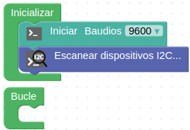

# 3.12. A11-La LCD de 2x16
## Las comunicaciones I2C
Dado que la placa PLUS dispone de un puerto de expansión I2C (del inglés Inter-Integrated Circuit = Circuito inter-integrado) vamos a explicar un poco en que consiste este sistema de conexionado.

Bus conocido por las siglas I2C, IIC o I²C, es un bus serie de datos desarrollado en 1982 por Philips Semiconductors (hoy NXP Semiconductors, parte de Qualcomm). Se utiliza principalmente internamente para la comunicación entre diferentes partes de un circuito, por ejemplo, entre un controlador y circuitos periféricos integrados. Posteriormente fue adoptado progresivamente por otros fabricantes hasta convertirse en un estándar del mercado con miles de circuitos integrados de diferentes fabricantes.

I2C también se denomina TWI (Two Wired Interface) únicamente por motivos de licencia, denominación introducida por Atmel. No obstante, la patente caducó en 2006, por lo que actualmente no hay restricción sobre el uso del término I2C.

El bus I2C requiere únicamente dos cables o lineas de señal para su funcionamiento, uno para la señal de reloj (SCL, Serial Clock) y otro para el envío de datos (SDA, Serial Data). Ambas líneas precisan resistencias de pull-up hacia Vcc. Cualquier dispositivo conectado a estas líneas es de drenador o colector abierto (Open Collector), lo cual en combinación con las resistencias pull-up, crea un circuito Wired-AND. En la Figura 3.12.1 vemos el diagrama básico de conexionado del bus con algunos ejemplos de dispositivos. La señal de reloj siempre es generada por el circuito que actúa como Master.

*Figura 3.12.1. Diagrama de conexión del bus I2C*

Para ser reconocido en el bus, cada dispositivo dispone de una dirección física, que se emplea para acceder a cada uno de ellos de forma individual. Esta dirección puede ser fijada por hardware, en cuyo caso se pueden modificar los últimos 3 bits mediante “jumpers” o microinterruptores, o por software.

En general, cada dispositivo conectado al bus debe tener una dirección única. Si tenemos varios dispositivos similares tendremos que cambiar la dirección o, en caso de no ser posible, implementar un bus secundario.

El bus I2C tiene una arquitectura de tipo master-slave, lo que indica que el master es el encargado de controlar al resto de dispositivos tipo slave con los que se comunica y que se comunican con el, teniendo siempre el master prioridad absoluta. El dispositivo master es el que inicia la comunicación con los slaves. Los slaves no pueden iniciar la comunicación (el master tiene que preguntarles), ni hablar entre si directamente.

El bus I2C debe ser por lo tanto síncrono, es decir debe existir una señal de reloj que controle las comunicaciones. Es el master el que proporciona la señal de reloj, que mantiene sincronizados a todos los dispositivos del bus. De esta forma, se elimina la necesidad de que cada dispositivo tenga su propio reloj, de tener que acordar una velocidad de transmisión y mecanismos para mantener la transmisión sincronizada como en una UART o SPI. En la imagen vemos un cronograma ejemplo del funcionamiento del sistema.

*Figura 3.12.2. Cronograma trabajo bus I2C*

El protocolo de comunicación I2C sigue la siguiente secuencia:

* Primero, el master genera la señal de reloj del bus (SCL).
* Se inicia la comunicación por orden del master al establecer la condición de START, que se produce cuando SDA pasa de uno a cero y se mantiene en cero durante un tiempo.
* El master direcciona a los slaves.
* El master indica si se va a leer o escribir.
* El slave direccionado responde con una señal de conformidad ACK (acknowledge).
* Se transmite los datos byte a byte desde SDA al receptor. Por cada pulso desde SCL se transmite un bit de información.
* El destinatario de la información responde con una señal de conformidad ACK.
* Se acaba la comunicación cuando el master establece la condición de STOP, que se produce cuando SDA, por orden del master pasa de cero a uno y se mantiene en uno durante un tiempo.

Son muchos los dispositivos I2C que se pueden direccionar por este bus I2C, siendo lo más común en los dispositivos para I2C que utilicen direcciones de 7 bits, aunque existen dispositivos de 10 bits, pero es un caso raro. Una dirección de 7 bits implica que se pueden poner hasta 128 dispositivos sobre un bus I2C. Hemos visto que las direcciones son de 8 bits y esto es porque el bit extra de los 7 de la dirección lo emplea el master para informar al slave si va a leer o escribir. Si el bit de lectura/escritura es cero, el dispositivo master está escribiendo en el slave. Si el bit es 1 el master está leyendo desde el slave. La dirección de 7 bit se coloca en los 7 bits más significativos del byte y el bit de lectura/escritura es el bit menos significativo.

### La LCD 1602
Una pantalla LCD (del ingés, Liquid Cristal Display) de 2 líneas de 16 caracteres tiene el aspecto y la distribución de pines que vemos en la Figura 3.12.3.

*Figura 3.12.3. LCD 2x16*

Es evidente que deberíamos utilizar bastantes patillas de nuestra placa UNO para su control. En la Figura 3.12.4 se muestra el conexionado mínimo necesario en una pantalla de este tipo: 4 bits para datos y dos señales de control: En (Enable) y Rs (Register select). La conexión RW la ponemos a GND. Además se debe añadir una resistencia ajustable o un potenciómetro para regular el contraste de la pantalla.

*Figura 3.12.4. Conexionado mínimo LCD 2x16*

Es preferible utilizar las que tienen el aspecto que vemos en la Figura 3.12.5.

*Figura 3.12.5. LCD 2x16 con módulo I2C*

En realidad el conjunto que vemos en la Figura 3.12.5 no es mas que una LCD 2x16 a la que se ha incorporado un módulo adaptador de LCD a I2C. Este modulo está especialmente diseñado para poder soldarlo directamente a la LCD y convertirla así en un dispositivo I2C que además ya lleva incorporado el potenciómetro de ajuste de contraste.

Esta pantalla requiere cuatro cables para establecer las conexiones, un cable para SDA (datos), otro para SCL (reloj) y los dos cables de alimentación VCC y GND.

La dirección I2C por defecto de este tipo de módulos puede ser 0x3F o en otros casos 0x27, e incluso hay modelos en los que se puede cambiar. Para un correcto control es muy importante identificar correctamente la dirección I2C de nuestro modulo, que en el caso de la que incorpora el kit Smart home es la 0x27, pues de otra forma nuestro programa no funcionará correctamente.

Una LCD 1602 I2C es muy sencilla de controlar a partir de los bloques que nos proporciona ArduinoBlocks. En la imagen siguiente ponemos como ejemplo los bloques para imprimir un texto o variable en un par fila-columna determinado y se muestra el sistema de distribución de filas y columnas.

*Figura 3.12.6. Bloques para imprimir en un par fila-columna*

### Escanear dispositivos I2C
Si no conocemos la dirección especifica de nuestro módulo podemos utilizar un pequeño programa que llamaremos Escaner-I2C y que se encargará de identificar la dirección I2C y todos los dispositivos I2C conectados a nuestra placa. Debemos crear un proyecto de tipo "Arduino UNO" para tener disponible el menú I2C que nos de acceso al bloque "Escanear dispositivos I2C..." tal y como vemos en la Figura 3.12.7.

*Figura 3.12.7. Menu I2C*

Un sencillo programa como el de la Figura 3.12.9 nos permite ver los dispositivos I2C conectados y su dirección física asociada. El programa está disponible como [Smart-home-detectar-IIC](http://www.arduinoblocks.com/web/project/916602). No se requiere ningún bloque para enviar datos a la consola porque lo hace el propio bloque de escaneo.

*Figura 3.12.8. Smart-home-detectar-IIC*

Si conectamos la consola el resultado de tener la Smart home conectada es el de la Figura 3.12.9.

*Figura 3.12.9. Consola para el programa Smart-home-detectar-IIC*

### Cambiar la dirección física de un dispositivo I2C
Esta tarea nos va a resultar especialmente útil si disponemos de LCDs I2C con una dirección fijada de fábrica y queremos conectar varias de ellas en nuestro proyecto. La parte posterior de la LCD 1602 de Keyestudio tiene el aspecto de la Figura 3.12.10. Nos fijaremos especialmente en los tres grupos de agujeros enmarcados en rojo. Aunque en este caso no vienen nombrados los vamos a denominar A0, A1 y A2 de izquierda a derecha.

*Figura 3.12.10. Pads configuración dirección física en la parte posterior LCD I2C*

La dirección por defecto de fábrica en este caso es la 0x27, pero se puede cambiar alterando la situación de conexionado de estos agujeros entre si según la tabla siguiente:

| A2 | A1 | A0 | Dirección |
|:|:|:|:|
| 0 | 0 | 0 | 0x27 |
| 0 | 0 | 1 | 0x26 |
| 0 | 1 | 0 | 0x25 |
| 0 | 1 | 1 | 0x24 |
| 1 | 0 | 0 | 0x23 |
| 1 | 0 | 1 | 0x22 |
| 1 | 1 | 0 | 0x21 |
| 1 | 1 | 1 | 0x20 |

Para establecer los unos de la tabla anterior basta con cortocircuitar los dos pads correspondientes. En la Figura 3.12.11 se ha establecido la dirección física como 0x26.

*Figura 3.12.11. Dirección 0x26*

### Definición de símbolos en la LCD
Dentro de los bloques del menú Visualización -> Pantalla LCD está el de "definir símbolo", que permite definir uno de los 8 símbolos personalizables que puede almacenar la pantalla LCD. El símbolo se define por un mapa de bits (unos y ceros indicando cada píxel del símbolo). Los símbolos tienen una resolución de 5x8 píxeles (blanco o negro).

En ArduinoBlocks disponemos de una herramienta que nos ayuda a definir nuestros propios símbolos y podemos acceder a ella desde herramientas o haciendo clic derecho sobre el bloque, desplegándose en cualquier caso un editor muy sencillo de usar y que vemos con un ejemplo en la Figura 3.12.12.

*Figura 3.12.12. Ejemplo de símbolo creado con el editor*

Para tener el símbolo disponible simplemente copiamos la cadena generada en el lugar correspondiente del bloque.

## **Multitarea**
Este apartado se extrae de ArduinoBlocks - FreeBook disponible en [Free Book (online & updated)](https://docs.google.com/document/u/1/d/e/2PACX-1vQSrOKHpbLQHVbGFdAvp7DcndoftoHDI20nvwGMaxu_7bGc1bUCmi4U6DZrJWRSudc2iXBg43QMuzCT/pub).

ArduinoBlocks nos permite utilizar una capa para implementar un sistema multitarea avanzado basado en FreeRTOS (del inglés Real Time Operating System), que es un sistema operativo de tiempo real kernel para dispositivos embebidos para plataformas de microcontrolador que se distribuye bajo licencia MIT. Este sistema permite crear tareas que se ejecutarán de forma paralela (virtualmente). En microcontroladores modestos como el Arduino UNO, Nano o incluso MEGA la multitarea con FreeRTOS es bastante limitada y consume gran parte de los recursos de nuestro Arduino, en caso de necesitar de un sistema multitarea más potente podemos optar por usarlo en placas basadas en ESP8266 o ESP32 con mucha más potencia y recursos (especialmente el ESP32 con doble núcleo y gran potencia de procesamiento y memoria interna)

*Los sistemas software de multitarea utilizan un planificador o scheduler que se encarga de repartir el tiempo de procesamiento entre las distintas tareas, de forma que a cada una le toca un tiempo de microcontrolador para ejecutar un poquito de su parte de programa.*

En las web de [freeRTOS](https://www.freertos.org/implementation/a00002.html), en su entrada de menú Kerne podemos encontrar los conceptos básicos de multitarea y de programación que vamos a extractar seguidamente.

### Conceptos básicos de multitarea
Un procesador convencional como el de Arduino UNO solo puede ejecutar una tarea a la vez, pero al cambiar rápidamente entre tareas, un sistema operativo multitarea puede hacer que parezca que cada tarea se ejecuta simultáneamente. Esto es lo que se representa en el diagrama de la Figura 3.12.13 que muestra el patrón de ejecución de tres tareas con respecto al tiempo. Los nombres de las tareas están codificados por colores y escritos a la izquierda. El tiempo se mueve de izquierda a derecha y las líneas de colores muestran qué tarea se está ejecutando en un momento determinado. El diagrama superior demuestra el patrón de ejecución concurrente percibido, y el inferior el patrón de ejecución multitarea real.

*Figura 3.12.13. Patrón de ejecución de tres tareas con respecto al tiempo*

### Programación
El programador es quien debe decidir qué tarea debe ejecutarse en un momento determinado. El kernel o núcleo puede suspender y luego reanudar una tarea muchas veces durante el tiempo de vida de la tarea.

Además de ser suspendida involuntariamente por el núcleo o kernel, una tarea puede optar por suspenderse a sí misma. Hará esto si desea retrasar (**dormir**) por un período fijo o esperar (**bloquear**) a que un recurso (por ejemplo, un puerto serie) esté disponible, o que ocurra un evento (por ejemplo, presionar una pulsador). Una tarea bloqueada o inactiva no se puede ejecutar y no se le asignará ningún tiempo de procesamiento.

En la Figura 3.12.14 vemos un posible diagrama de ejecución de tres tareas analizado punto por punto en distintos instantes de tiempo. En los cículos se representan los instantes de tiempo t1 a t10.

*Figura 3.12.14. Diagrama de ejecución de tres tareas en el tiempo*

* **t1:** la tarea 1  se está ejecutando.
* **t2:** en el kernel se suspende, o mejor dicho se intercambia, la tarea 1 .
* **t3:** se reanuda la tarea 2.
* **t4:** mientras se ejecuta la tarea 2 el procesador bloquea el puerto serie para su acceso exclusivo.
* **t5:** el kernel suspende la tarea 2.
* **t6:** el kernel reanuda la tarea 3.
* **t1:** la tarea 3 intenta acceder al puerto serie y lo encuentra bloqueado por lo que no puede continuar y se suspende.
* **t8:** el kernel reanuda la tarea 1 .
* **t9:** al ejecutarse de nuevo la tarea 2 se desbloquea el puerto serie.
* **t10:** la tarea 3 ahora si puede acceder al puerto serie y se ejecuta al completo

### Planificadores
Los planificadores de multitarea permiten asignar a cada tarea una prioridad, para así darle preferencia a las tareas más críticas o que necesitan más tiempo de procesamiento. Si creamos muchas tareas con “alta” prioridad puede que afectemos a las demás dejando poco tiempo de procesamiento para ellas. En la Figura 3.12.15 vemos un esquema de varias tareas con distintas prioridades, variando así su tiempo de microprocesador asignado.

*Figura 3.12.15. Distintas prioridades en tres tareas*

Cada tarea tiene su propio espacio de memoria, por lo que crear demasiadas tareas también puede dejarnos el procesador sin memoria. Si la memoria asignada a las tareas tampoco es suficiente para almacenar los datos se podría reiniciar de forma inesperada el Arduino, o funcionar incorrectamente, es decir que como siempre, hay que ser consciente de los limitados recursos de los que disponemos.

### Semáforos
Con la introducción teórica a la multitarea vista, debemos hacernos otra pregunta: ¿Qué pasa si una tarea accede a un recurso o variable, y el sistema multitarea le da el control a otra tarea y por tanto ese proceso falla o quizás otra tarea acceda al mismo recurso y se solapen?

Para ese problema de convivencia entre tareas se inventaron los “semáforos”, en concreto el que más nos interesa es el semáforo “mutex” o de exclusión mutua, que permite que bloqueemos el sistema multitarea, hagamos lo que tengamos que hacer crítico, y luego liberemos el control. Por supuesto estas tareas críticas deben ser lo más cortas y atómicas posibles: una escritura crítica en una variable, un envío de un dato, una actualización de una pantalla LCD,... siempre cosas simples. Los semáforos debemos usarlos en casos que tengamos claro que se pueden crear conflictos, pues su abuso puede hacer que el sistema multitarea empiece a fallar.

En la Figura 3.12.16 vemos el esquema de acceso a un recurso desde dos tareas diferentes.

*Figura 3.12.16. Esquema de acceso a un mismo recurso por parte de 2 tareas diferentes*

### Bloques esperar
¿Qué pasa con los bloques tipo “esperar” que estaban tan prohibidos en la programación de Arduino cuando queríamos simular una multitarea antes de tener estos bloques? Pues seguimos teniéndoles bastante tirria. Aunque en teoría podríamos usarlos, un bloque esperar hace pensar al microcontrolador que está haciendo algo útil, cuando en realidad no es así, por lo que el sistema multitarea querrá asignarle tiempo de procesamiento a la tarea, aunque sea para eso, ¡para no hacer nada!

Tenemos una solución, tenemos un nuevo bloque de esperar “task friendly” que en lugar de esperar sin hacer nada le dice al sistema: ¡voy a estar un rato sin hacer nada, permite ejecutar otras tareas mientras y luego vuelves!  ….Mucho más “friendly”, claro que sí.

### Bloques
Con toda esta información pasamos a ver los bloques disponibles para poner todo ésto en marcha.

| Bloque | Descripción |
|:-:|---|
|  |Permite crear una nueva tarea con su bloque de “inicializar” y su “bucle” al igual que la tarea original de Arduino.   Debemos asignar una prioridad a cada tarea, por defecto dejaría todas a “baja” y luego iría ajustando si hace falta.    Para gestionar mejor las prioridades, es recomendable en algunos casos no utilizar el “inicializar” y “bucle” propio de Arduino que suele tener preferencia sobre todas estas tareas y es más difícil de equilibrar las prioridades.  |
|  | El bloque esperar óptimo para tareas, pues deja funcionar al resto de tareas de forma más óptima mientras se espera en ésta.  Este bloque tiene menos precisión que el bloque “esperar” original, si necesitamos hacer esperas muy precisas (o de menos de 20 ms) debemos usar el “esperar” tradicional. Pero nos servirá en la mayoría de casos.  |
|  |Si tenemos que hacer alguna acción crítica que no queremos que sea interrumpida internamente por el planificador del sistema multitarea podemos poner este bloque y dentro los bloques críticos. (no utilizar si no es estrictamente necesario) |
|  |Cada tarea tiene su propio espacio de memoria reservado, esta es la cantidad por defecto para las tareas (192 bytes), si necesitamos ajustarla podemos utilizar este bloque en el “inicializar” principal y se ajustará para todas las tareas.  Un mal ajuste puede provocar reinicios del microcontrolador o mal funcionamiento. |
|  |Las tareas en principio, igual que el bucle de Arduino, están pensadas para ejecutarse de forma indefinida, si en un caso una tarea deja de ser necesaria la forma de terminarla es con este bloque que parará la ejecución y liberará la memoria de la tarea en la que se ejecuta.|

## **Actividades**
### Actividad A11_1
En esta actividad enviaremos un texto a la LCD. El programa final lo tenemos disponible en el enlace [Smart-home-A11_1](../programas/Smart-home-A11_1.abp).

*Figura 3.2.17. Solución A11_1*

### Actividad A11_2
En esta actividad enviaremos a la LCD el valor leído por la LDR y el nombre de la canción que suena de forma simultánea como primera tarea. Una segunda tarea es reproducir distintas canciones y actualizar el nombre de la variable. El programa final lo tenemos disponible en el enlace [Smart-home-A11_2](../programas/Smart-home-A11_2.abp).

*Figura 3.2.18. Solución A11_2*

