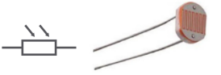
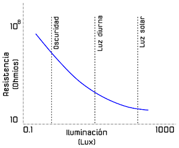
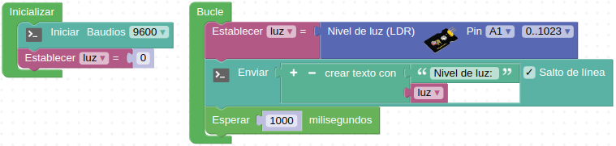
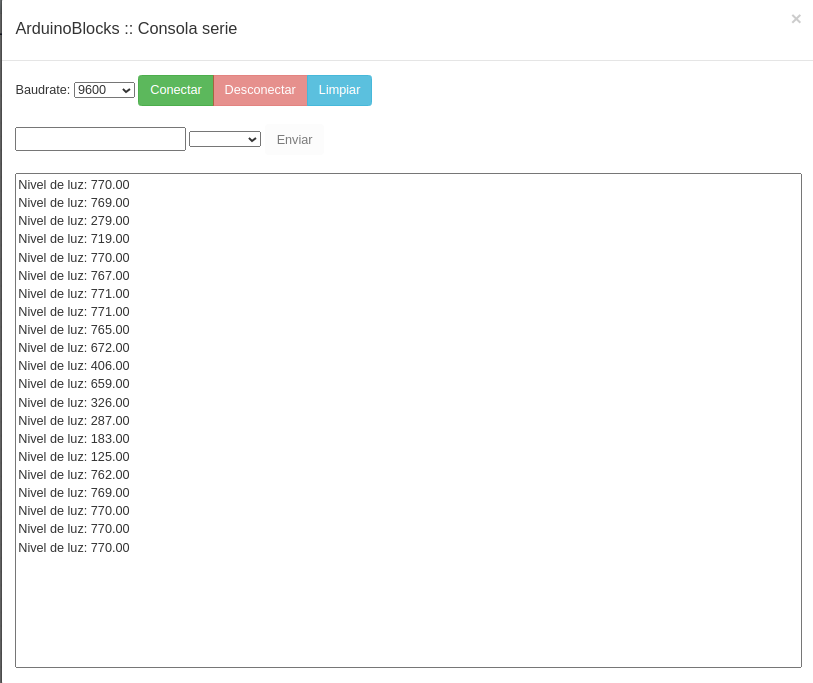
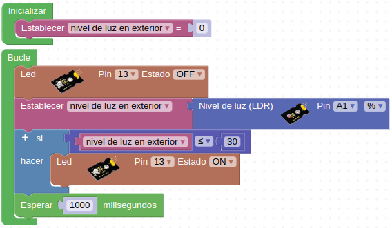

# 3.6. A05-Fotocélula LDR
## Teoría
Una fotorresistencia, fotorresistor o LDR es un componente electrónico cuya resistencia disminuye de forma exponencial con el aumento de la intensidad de luz incidente. Las siglas LDR vienen de su nombre en inglés, que es Light Dependent Resistor. En la imagen siguiente tenemos el símbolo, el aspecto real de una LDR y su curva característica de variación de resistencia con la iluminación.

| Simbolo y aspecto de la LDR | Curva característica |
|:|:|
|  | |

### Actividad A05_1
Esta primera actividad va a consistir sencillamente en detectar el nivel de iluminación con la LDR (pin A1) y enviar el resultado a la consola. La solución la tenemos disponible en [Smart-home-A05_1](../programas/Smart-home-A05_1.abp).

*Figura 3.6.1. Solución A05_1*

En la Figura 3.6.2 vemos el resultado generado en la consola.

*Figura 3.6.2. Consola A05_1*

### Actividad A05_2
Programar un interruptor crepuscular utilizando la LDR (pin A1) y el LED exterior de color blanco (pin 13) que simula el farol exterior. El nivel de luz mínimo permitido antes de encender el farol es del 30%, de forma que con un valor menor o igual al 30% se encienda el LED y con un valor mayor permanezca apagado. La solución la tenemos disponible en [Smart-home-A05_2](../programas/Smart-home-A05_2.abp).

*Figura 3.6.3. Solución A05_2*

