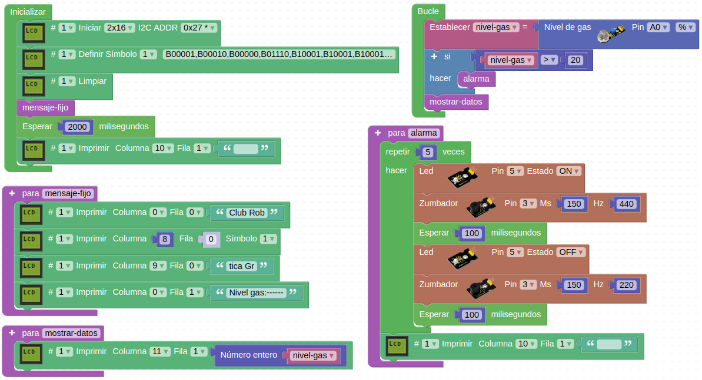

# 5.1. Reto 1 - Alarma por gas
Realizar un programa que emita un sonido y ponga intermitente el diodo LED amarillo si se supera el nivel de gas establecido. Se muestra información en la pantalla LCD del nivel de gas detectado.

* En la Figura 5.1.1 vemos el programa en ArduinoBlocks.

*Figura 5.1.1. Solución Reto 1*

En la visualización en pantalla los valores de gas se muestran en tanto por ciento.

* Si preferimos descargar el proyecto a nuestro ordenador, desde el archivo [Smart-home-Reto1.abp](../img/5/Smart-home-Reto1.abp) podemos hacerlo para posteriormente importarlo. 
