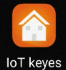
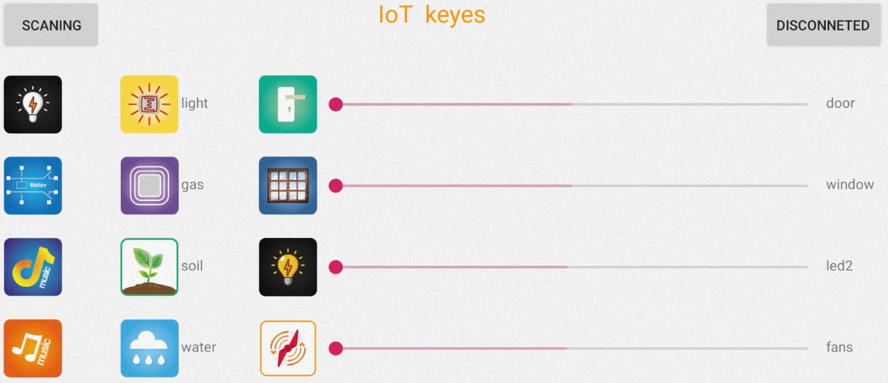
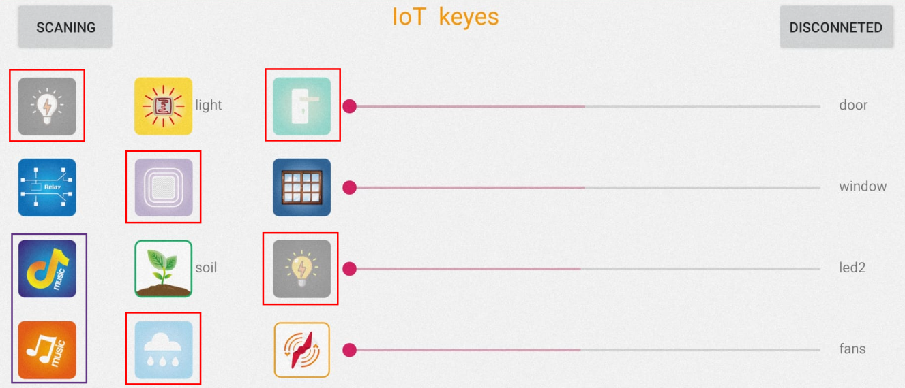
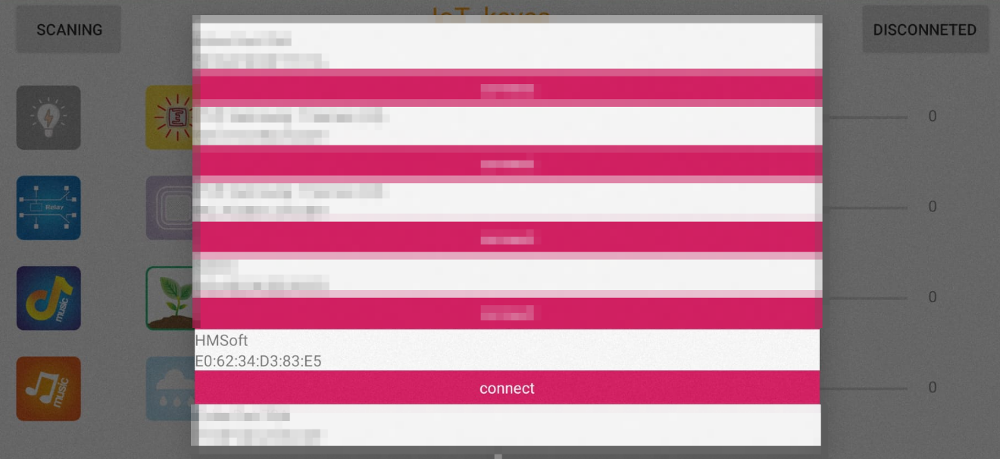
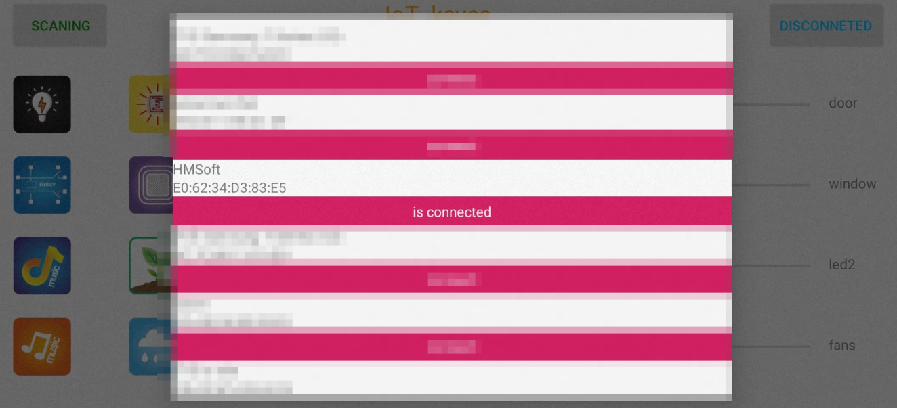
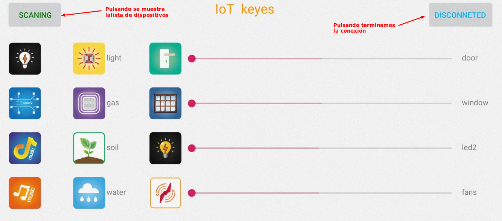
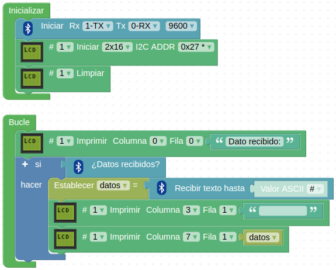
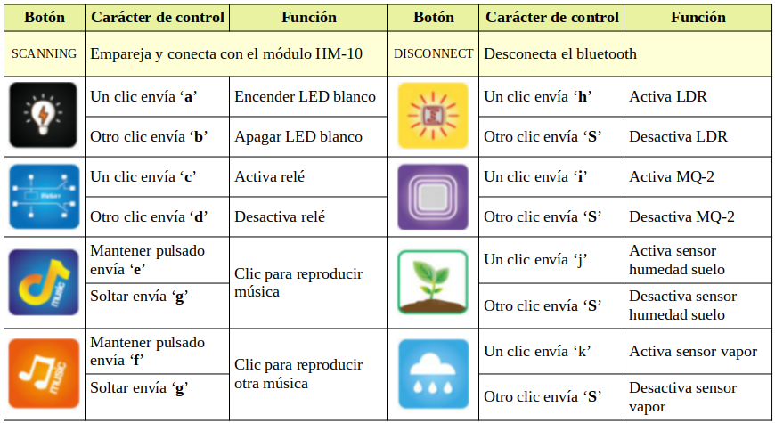
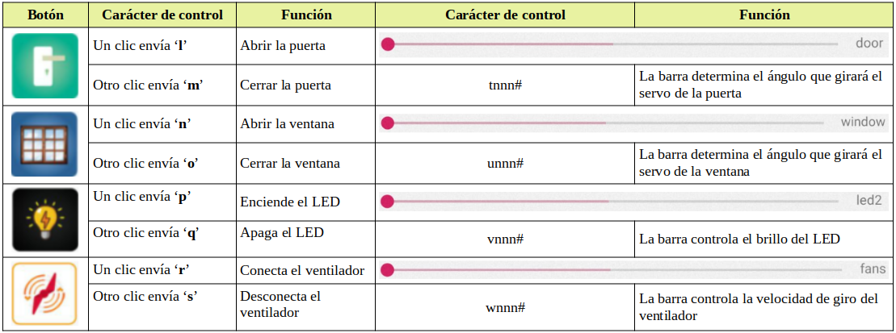

# 4.2. APP
Este apartado lo dedicamos a la descripción y uso de la aplicación de Keyestudio “keyes IoT” pensada para el control por Bluetooth de los elementos de la Smart home.

Antes de nada debemos instalar la aplicación en nuestro móvil. Vamos a ver solamente para el sistema Android. Podemos instalar la aplicación por cualquiera de estos medios:

* Descargar "IoT Keyes" desde el dropbox de keyestudio: [Enlace a manual en inglés y app](https://www.dropbox.com/sh/ar08yhfclup2uak/AADeWMNtWd0vnDLXinPCwRnla/3.%20APP?dl=0&subfolder_nav_tracking=1)
* Descargar "IoT Keyes" desde el repo de esta web: [Descarga keyes IoT.apk](../app/keyes_20IoT.apk)
* Instalarla desde Play Store, que quizá sea la forma mas sencilla

Una vez instalada la aplicación en nuestro móvil se mostrará el icono que vemos en la Figura 4.2.1.

*Figura 4.2.1. Icono IoT keyes*

Cuando abrimos la aplicación la pantalla se verá como en la Figura 4.2.2.

*Figura 4.2.2. Ventana principal de la aplicación*

Hay 16 botones de control en la aplicación que al presionarlos se envía desde el teléfono un determinado carácter si está desactivado y otro si el botón ha sido activado previamente. Esta situación se diferencia porque cuando el botón está pulsado aparece en pantalla difuminado. En la Figura 4.2.3 vemos algunos botones en esta situación de pulsados (enmarcados en rojo) y el resto sin pulsar. Podemos decir que los botones actúan como interruptores pues mantienen su posición.

*Figura 4.2.3. Pantalla app con algunos botones accionados*

Hay dos botones espaciales que se han enmarcado en un rectángulo morado, son los de música y estos no se activan como el resto, sino que envían un carácter mientras se mantienen pulsados y otro cuando se sueltan, es decir, dos caracteres en lugar de uno.

Por otro lado tenemos las barras deslizantes para hacer el control PWM del servo de la puerta, del de la ventana, de la luminosidad del LED blanco y la velocidad del motor DC del ventilador. Estos deslizados envían un número que representa el valor del deslizador y un código de finalización que es el carácter #. El valor de los deslizadores de la puerta y la ventana varía entre 0 y 180 y el del LED y el ventilador entre 0 y 250. Es decir, los botones de esta columna abren o cierran la puerta o la ventana y activan o desactivan la luz y el ventilador y los deslizadores controlan los ángulos de movimiento de los servos entre 0 y 180º, el nivel de luz emitido y la velocidad del ventilador.

Estos códigos que envía nuestro móvil los recibe el Bluetooth y son enviados a la placa de control, lo que nos permitirá programar una aplicación de control de la Smart home desde el móvil con esta aplicación. Nuestra primera tarea será averiguar los códigos que la app envía, como veremos posteriormente.

En la parte superior izquierda de la ventana de la app tenemos el botón "SCANNING", que si lo pulsamos nos va a mostrar una lista de todos los dispositivos Bluetooth que estén en el alcance del móvil. Teniendo alimentada la smart home y el módulo HM-10 conectado vemos que el LED que lleva incorporado parpadea. En esta situación pulsamos el botón "SCANNING" y se nos mostrará la lista donde debemos encontrar uno llamado **HMSoft**, tal y como vemos en la Figura 4.2.4, donde observamos como ese dispositivo se marca como conectado.

*Figura 4.2.4. Lista de dispositivos escaneados*

Si pulsamos el botón rojo 'connect' el LED en el módulo dejará de parpadear, la situación cambia a conectado (Figura 4.2.5) y sobre el botón rojo aparece el texto "is connected", indicando precisamente la situación de que la app y el módulo están conectados vía Bluetooth. En la imagen de la Figura 5.2.5 observamos el nombre del dispositivo Bluetooth (HMSoft) y debajo la dirección MAC del mismo, por si necesitamos trabajar con ella.

*Figura 4.2.5. HMSoft conectado con el HM-10*

Si volvemos a pulsar el botón rojo desconectamos los dispositivos volviendo a la situación de partida.

Si tocamos en cualquier parte de la pantalla fuera de la que abarcan los botones (zona en primer plano en blanco y rojo) estaremos en situación de trabajar con la app enviando datos a la placa. En la Figura 4.2.6 vemos el estado de la pantalla con los dispositivos conectados.

*Figura 4.2.6. App lista para enviar códigos*

En dispositivos Android debemos permitir que la aplicación acceda a la "ubicación" cuando la app está en uso; de lo contrario, es posible que el Bluetooth no permanezca conectado. 

## Programa de prueba
Antes de hacer nada mas con la app necesitamos saber los código que envía cuando pulsamos cada uno de los botones y cuando cambiamos la posición de los deslizadores. En la documentación [KS0085 Keyestudio Smart Home Kit for Arduino](https://wiki.keyestudio.com/KS0085_Keyestudio_Smart_Home_Kit_for_Arduino) podemos encontrar la información, en inglés, referida al carácter de control y la función de cada parte de la app y un ejemplo para el IDE de Arduino, vamos a crear un programa en ArdinoBlocks que nos muestre en la LCD, en cada momento, el comando que se ha enviado desde el móvil y que se ha recibido en la placa de control. Debemos cargar en nuestra placa "PLUS" el programa [Smart-home-test-app](http://www.arduinoblocks.com/web/project/917278) que vemos en la Figura 4.2.7 y comprobar los código enviados por cada elemento de la app.

*Figura 4.2.7. Programa de prueba de la app*

Recordemos que para poder cargar el programa en la placa debemos desconectar al menos uno de los pines Tx o Rx del módulo Bluetooth o nos generará un error. Una vez cargado el programa reconectamos el Bluetooth, abrimos la app, tocamos en "SCANNING" para conectarnos con el módulo HM-10 de nombre "HMSoft" y una vez conectados comenzamos a enviar códigos desde la app para ver su valor ASCII (letras) y/o numérico (deslizadores) enviado.

## Descripción botones de la app
En la Figura 4.2.8 vemos resumidos los botones de las dos primeras columnas, los caracteres de control y la función que tienen.

*Figura 4.2.8. Función y caracteres de botones de las dos primeras columnas*

En la Figura 4.2.9 vemos resumidos los botones restantes, los caracteres de control y la función que tienen. En esta ocasión el botón envía su carácter de control y el deslizador un número (nnn) seguido del símbolo # que indica que hemos soltado la barra deslizante. La codificación del deslizador es, para el caso de la puerta, tnnn#, donde t indica abrir la puerta, nnn el valor de la barra y # el carácter de finalización.

*Figura 4.2.9. Función y caracteres de botones restantes y deslizadores*

