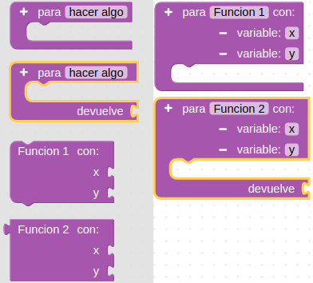
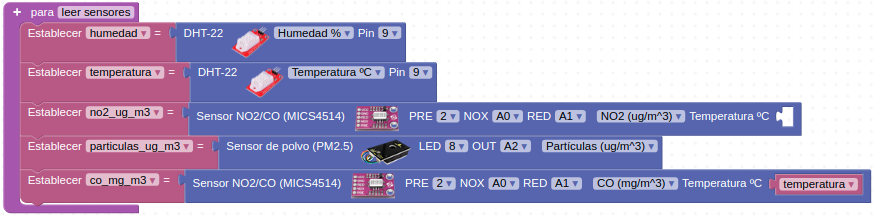
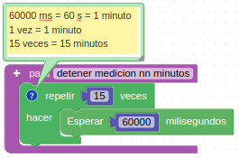

# 3.3. A02-Zumbador o buzzer

### El zumbador
El buzzer o zumbador o altavoz es un transductor electroacústico (convierte una señal eléctrica en una onda de sonido) que produce un determinado zumbido o sonido. Existen de dos tipos:

* *Pasivos*: no disponen de electrónica interna, por lo que tenemos que proporcionar una señal eléctrica para conseguir el sonido deseado.
* *Activos*: disponen de un oscilador interno, por lo que únicamente tenemos que alimentar el dispositivo para que se produzca el sonido.

El zumbador que incorpora la smart house es de tipo pasivo y está conectado al pin D3.

Una de los parámetros que caracterizan a un sonido es su frecuencia de emisión, siendo la frecuencia el número de veces que se repite por unidad de tiempo (segundo). La transmisión del sonido se realiza por ondas a través en cualquier medio (sólido, líquido o gaseoso) excepto en el vacío. La frecuencia de un sonido nos indica cuantos ciclos por segundo tiene una onda.

En la imagen y la tabla siguientes vemos un dibujo con un fragmento de las teclas de un piano estando todo referido a una nota estándar, la nota "La" central que tiene una frecuencia de 440 Hz. Podemos ver la nota musical que reproduce, en las dos notaciones más comunes de los sonidos (Inglés: C D E F G A B, Alemán: C D E F G A H, Español, italiano y francés: Do Re Mi Fa Sol La Si) y además se encuentra la frecuencia que produce esa nota musical.

| Sección de piano y notas |
|:|
|  |

En ArduinoBlocks disponemos de un bloque que nos permite reproducir cualquier melodía RTTTL (del inglés, Ring Tone Text Transfer Language) y es el que vemos en la imagen siguiente:

| Bloque Reproducir RTTTL |
|:|
|  |

Este bloque permite reproducir una melodía a partir de un texto con formato RTTTL, formato desarrollado por Nokia para ser usado para transferir tonos de llamada a teléfonos móviles. El formato RTTTL es una cadena dividida en tres secciones: nombre, valor predeterminado y datos. Por ejemplo, la siguiente cadena de texto se corresponde con la Intro de Donkey Kong:

 d=4,o=5,b=140:8a#,8p,8d6,16p,16f.6,16g.6,16f.6,8a#,8p,8d6,16p,16f.6,16g.6,16f.6,8a#,8p,8d6,16p,16f.6,16g.6,16f.6,8a#,8p,8d6,16p,16f.6,16g.6,16f.6

Lo único que tenemos que hacer para reproducir la melodia es pegar esta cadena en la zona de texto del bloque.

ArduinoBlocks nos suministra información y enlaces referentes al tema accediendo desde nuestro proyecto a herramientas y escogiendo RTTTL Info, tal y como vemos en la imagen siguiente:

| Acceso a RTTTL Info |
|:|
|  |

En la imagen siguiente tenemos desplegada la información que nos ofrece esta herramienta.

| Información RTTTL |
|:|
|  |

También podemos acceder a esta información haciendo clic derecho sobre el bloque y escogiendo la opción "Ayuda" de entre las mostradas en la ventana emergente.

## **Funciones**
Una función permite crear un grupo de bloques de código que realizan una determinada tarea y que se repite a lo largo del programa en varias ocasiones. Con la creación de una función evitamos repetir todos esos bloques y simplemente tendremos que invocar a la función. Es muy conveniente que los nombre que usemos sean lo mas descriptivos posibles de lo que hace la función. Existen dos tipos de funciones: las que no retornan un valor y las que si lo hacen. En la imagen siguiente vemos los bloques correspondientes a las mismas:

| Bloques para crear funciones en ArduinoBlocks |
|:|
|  |

Cuando creamos funciones automáticamente se crea el bloque con su nombre que permite invocarla, tal y como vemos en la imagen siguiente:

| Bloques para llamada a funciones |
|:|
|  |

También es posible crear funciones a las que se le envían datos o parámetros haciendo uso del signo + que aparece en los bloques. En la imagen siguiente vemos como le hemos añadido un par de parámetros a cada tipo de función y como se han modificado sus respectivos bloques de invocación.

| Bloques para llamada a funciones con parámetros |
|:|
|  |

Un ejemplo típico descriptivo del funcionamiento de las funciones es el de calculo del área de un triángulo. Para ello definimos la función que realiza el cálculo, le pasamos dos parámetros, la base y la altura, realizamos los cálculos pitagóricos y nos devuelve el área del triángulo para esos datos. En la imagen siguiente tenemos la idea de resolución con la función creada y el bloque para llamarla.

| Ejemplo de calculo del área de un triángulo |
|:|
|  |

En las imágenes siguiente vemos como se han creado diferentes funciones y la forma de llamarlas. En concreto se corresponden con la base del programa de [Educacont](http://educacont.org/) para configurar y grabar en la correspondiente estación. La primera función es "leer sensores" y la vemos en la imagen siguiente:

| Función leer sensores de Educacont |
|:|
|  |

En la imagen siguiente podemos ver la función encargada de subir los datos leídos a la nube.

| Función subir datos a la nube de Educacont |
|:|
|  |

La siguiente función permite detener las mediciones durante 15 minutos.

| Función detener medición nn minutos de Educacont |
|:|
|  |

El bucle principal tiene la configuración que vemos en la imagen siguiente:

| Llamada a las funciones definidas |
|:|
|  |

### Actividad A02_1
En el bloque Zumbador podemos modificar dos parámetros, el tiempo que dura cada sonido expresado en milisegundos (campo Ms) y la frecuencia en Hz a la que reproducirá el sonido el zumbador (campo Hz).

Vamos a comenzar haciendo un programa (Figura 3.3.1) que reproduzca tres de las notas de la escala musical vista anteriormente. La solución la tenemos disponible en [Smart-home-A02_1](../programas/Smart-home-A02_1.abp).

*Figura 3.3.1. Solución A02_1*

### Actividad A02_2
Reproducir la escala musical con las notas básicas utilizando los bloques Zumbador y Tono como vemos en la Figura 3.3.2. La solución la tenemos disponible en [Smart-home-A02_2](../programas/Smart-home-A02_2.abp).

*Figura 3.3.2. Solución A02_2*

### Actividad A02_3
Reproducir la melodía de la Figura 3.3.3 sabiendo que las negras tienen una duración de 500ms, las negras con un puntito (duración de negra mas corchea o lo que es lo mismo, un pulso y medio) 750ms y las blancas 1000ms.

*Figura 3.3.3. Partitura*

Se trata de un fragmento del himno a la alegría que vamos a programar utilizando funciones. En la Figura 3.3.4 vemos el programa completo. La solución la tenemos disponible en [Smart-home-A02_3](../programas/Smart-home-A02_3.abp).

*Figura 3.3.4. Solución A02_3*

### Actividad A02_4
Reproducir diferentes melodías a partir de los bloques RTTTL (Ring Tone Text Transfer Language o lenguaje de tonos de llamada). La solución es sencilla, basta con escoger el bloque Zumbador Reproducir RTTTL y acoplarle el bloque RTTTL escogiendo la melodía a reproducir. En la solución se han puestos dos grupos de bloques con dos de las posibles melodías dejando un tiempo de 5 segundos entre una y otra. En este caso además los bloques se han colocado en "Inicializar" por lo que solamente se van a ejecutar una vez y no de manera indefinida. Si queremos oírlo de nuevo debemos hacer reset en la placa o desconectar y conectar la alimentación.

En la Figura 3.3.5 vemos el programa completo. La solución la tenemos disponible en [Smart-home-A02_4](../programas/Smart-home-A02_4.abp).

*Figura 3.3.5. Solución A02_4*

