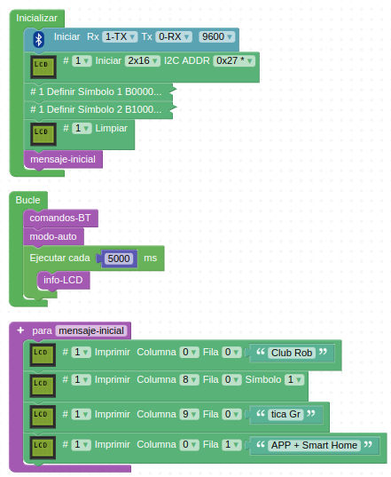

# 5.3. Reto 3 - Control Smart Home con APP
En este último reto vamos a programar todas las posibilidades que nos ofrece la APP IoT keyes enviando comandos desde la misma y recibiendo datos desde la Smart home todo en modo de prueba de funcionalidad sin entrar en detalles de aplicación concreta. Es decir, recibiremos en nuestro móvil el nivel de humedad del suelo (valor en bruto entre 0 y 1023) sin tomar ninguna acción, como podría ser que se activase una bomba de riego a través del relé, pero estas funcionalidades quedan como propuestas que cada uno resolverá según sus preferencias. Utilizaremos como base la información del apartado [4.2. APP](app.md).

* En la Figura 5.3.1 vemos el programa en ArduinoBlocks. Podemos observar como al tratarse de un programa bastante grande la visualización en pantalla ya no resulta muy buena para poder seguir la imagen y crear nuestro propio programa o entender el funcionamiento. Posteriormente analizamos el programa por partes.

*Figura 5.3.1. Solución Reto 2*

* Podemos descargar el proyecto a nuestro ordenador, desde el archivo [Smart-home-Reto3.abp](../img/5/Smart-home-Reto3.abp) podemos hacerlo para posteriormente importarlo.

## **Explicación del programa**
En la Figura 5.3.2 vemos los bloques "Inicializar" y "Bucle" además de la función "mensaje-inicial" que no requieren mayor explicación.

*Figura 5.3.2. Bloques "Inicializar" y "Bucle" y función "mensaje-inicial"*

Dentro de "Bucle" existe un bucle que se ejecuta cada 5 segundos con una llamada a la función "info-LCD" que vemos en la Figura 5.3.3 que se encarga de detectar presencia de forma continuada.

*Figura 5.3.3. Función "info-LCD"*

La función "comandos-BT" tiene dos tipos de funcionalidades, la primera parte se encarga de preguntar si se están recibiendo datos por Bluetooth, y si es cierto comienza a tomar acciones que comienzan por guardar en una variable el dato recibido y llamar a la función "comando-PWM" que veremos a posteriori. En la figura 5.3.4 vemos la primera parte de esta función y se ve la funcionalidad de la primera columna de botones.

*Figura 5.3.4. Función "comandos-BT" primera columna de botones*

En la Figura 5.3.5 vemos la segunda columna de botones. En este caso la funcionalidad es totalmente diferente a la anterior y lo que se hace es enviar datos desde los sensores a la APP para que los muestre.

*Figura 5.3.5. Función "comandos-BT" segunda columna de botones*

En la Figura 5.3.6 vemos la pantalla de la APP con los botones activados y recibiendo datos de los sensores.

*Figura 5.3.6. Datos de sensores recibidos en la APP*

La tercera parte de la función "comandos-BT" es la que vemos en la Figura 5.3.7.

*Figura 5.3.7. Función "comandos-BT" tercera columna de botones*

Las funcionalidades son abrir y cerrar la puerta y la ventana, apagar y encender el LED amarillo y encender y apagar el ventilador.

La función "Comando-PWM" (Figura 5.3.8) es la encargada de recibir los datos según el comando enviado, recibiendo como texto el valor del deslizador detectándose el final del dato por el carácter '#'. Los datos de texto son pasados a numéricos para poder actuar con los dispositivos con funciones PWM.

*Figura 5.3.8. Función "comandos-BT" controles PWM*

Además en el programa se ha implementado una función "modo-auto" (Figura 5.3.9) para trabajar con los botones que incorpora la Smart home.

*Figura 5.3.9. Función "modo-auto"*

## **Nota final**
Con esto hemos llegado al final de la documentación sobre domótica simulada con el Kit KS0085 Smart Home de Keyestudio. Espero que te diviertas aprendiendo domótica con estas notas.

Es mi intención ampliar los contenidos con otros ejemplos y profundización en este tema, pero a septiembre de 2022solamente tendrá este contenido.

