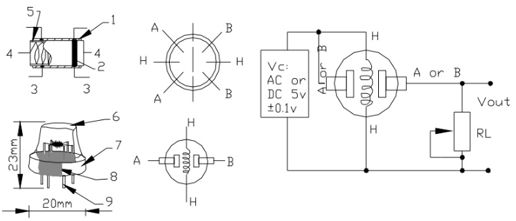
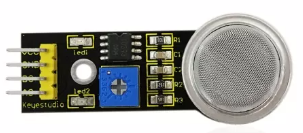
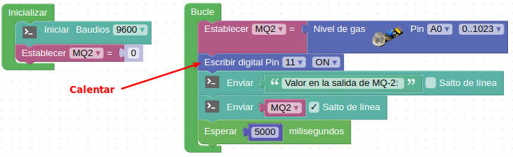
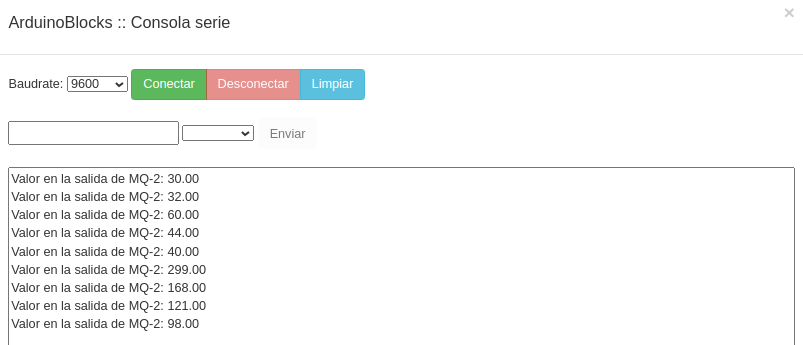
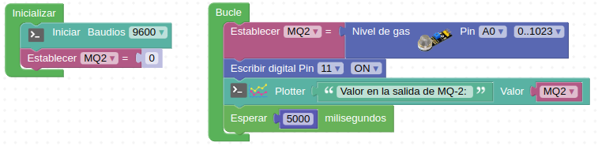
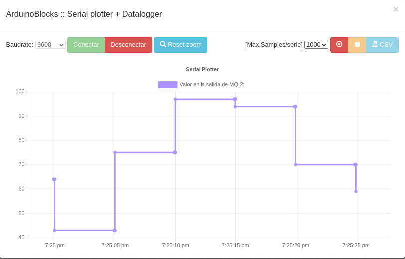
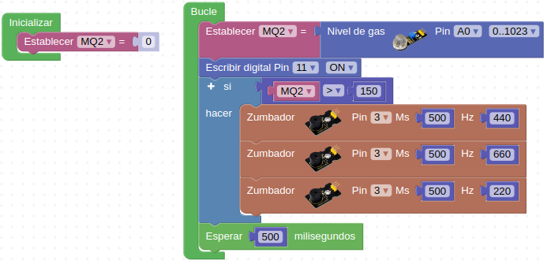

# 3.11. A10-Sensor de gas MQ-2
## Teoría
Toda la serie MQ son sensores electroquímicos y varían su resistencia cuando se exponen a determinados gases, internamente poseen un calentador (es normal que los toquemos y notemos el calor) encargado de aumentar la temperatura interna y con esto el sensor pueda reaccionar con los gases provocando un cambio en el valor de la resistencia. En la Figura 3.11.1 tenemos diagramas básicos de como están constituidos estos sensores.

*Figura 3.11.1. Diagramas sensores MQ*

El material sensible es el dióxido de estaño (SnO2) que tiene menor conductividad cuando el aire está limpio y aumenta esta cuando detecta un aumento de la concentración de gases.

Los sensores MQ requieren esperar un tiempo de calentamiento para que la salida sea estable y tenga las características que el fabricante muestra en sus datasheet, dicho tiempo dependiendo del modelo puede variar entre 12 y 48 horas. En concreto en el [datasheet del MQ-2](datasheet/MQ2.pdf) podemos ver que para este sensor se requieren alrededor de 24 horas.

El sensor MQ-2 es adecuado para detectar hidrógeno, GLP, metano (CH4), Monóxido de carbono (CO), alcohol, humo y propano (C3H8). Presenta su mayor sensibilidad a los GLP y al propano.

El sensor de gas MQ-2 es analógico y se utiliza en la detección de fugas de gas de equipos en los mercados de consumo y la industria, este sensor tiene una alta sensibilidad ajustable mediante el potenciómetro que incorpora el módulo, y un tiempo de respuesta rápido.

El aspecto del módulo sensor MQ-2 lo vemos en la Figura 3.11.2.

*Figura 3.11.2. Aspecto MQ-2*

El sensor dispone de 4 pines, que son:

* VCC: Alimentación positiva de 5V
* GND: Masa o 0V
* D0: Se conecta a un pin digital en estado alto y se encarga del calentamiento del sensor.
* A0: Salida analógica del sensor.

### Actividad A10_1
En esta actividad vamos a leer directamente el valor entregado por el sensor MQ-2 (pines 11 y A0) enviando los datos al terminal serie. La solución la tenemos disponible en [Smart-home-A10_1]().

*Figura 3.11.3. Solución A10_1*

En la Figura 3.11.4 vemos los resultados de la lectura en la consola serie y se aprecia el aumento en el aire de algún gas y la disminución cuando este se va disipando.

*Figura 3.11.4. Consola A10_1*

### Actividad A10_2
En lugar de enviar los datos a la consola serie como en A10_1 los enviamos al Serial Plotter. La solución la tenemos disponible en [Smart-home-A10_2](http://www.arduinoblocks.com/web/project/915451).

*Figura 3.11.5. Solución A10_2*

En la Figura 3.11.6 vemos una captura del datalogger.

*Figura 3.11.6. Serial plotter A10_2*

### Actividad A10_3
Montamos una alarma sonora por detección de gas. La solución la tenemos disponible en [Smart-home-A10_3](http://www.arduinoblocks.com/web/project/915437).

*Figura 3.11.7. Solución A10_3*

