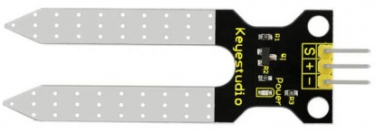
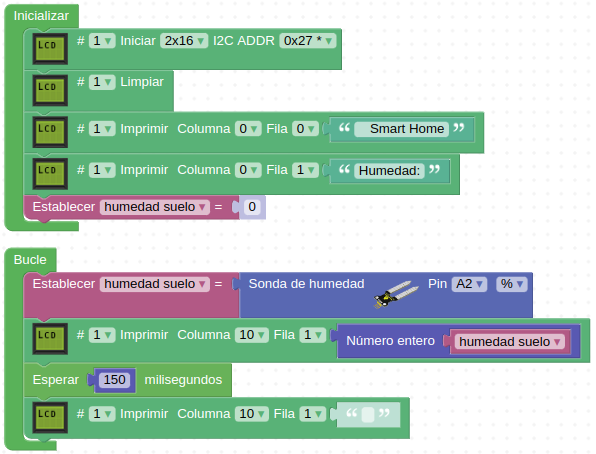

# 3.13. A12-Sensor de humedad del suelo
## Teoria
Este es un sensor analógico de humedad ideado para detectar la humedad del suelo. Si el suelo no está húmedo, el valor analógico emitido por el sensor disminuirá, de lo contrario, aumentará. Se puede usar este sensor para hacer un dispositivo de riego automático que detecte si una planta necesita ser regada. Usar el sensor con una placa tipo Arduino hace que nuestra planta pertenezca a un jardín inteligente.

El sensor se construye con dos sondas listas para ser insertadas en el suelo, y así con la corriente que circula por el suelo, el sensor obtendrá un valor de resistencia que le permite leer los cambios que se producen entre las dos sondas y convertir dicho valor de resistencia en contenido de humedad del suelo. Cuanto mayor sea la humedad (menos resistencia), mayor será la conductividad del suelo. La superficie del sensor se ha metalizado para prolongar su vida útil.

En la Figura 3.13.1 podemos ver el aspecto que tiene este sensor.

*Figura 3.13.1. Aspecto del sensor de humedad del suelo*

Sus principales especificaciones son:

* Alimentación: 3.3 o 5V
* Consumo: ≤ 20mA
* Tensión de salida: de 0 a 2.3V (alimentado a 5V). La mayor tensión corresponde al sensor totalmente sumergido en agua.
* Tipo de salida: analógica.
* Vida útil: un año aproximadamente.
* Superficie: estañada para mejorar su conductividad y durabilidad

### Actividad A12_1
En esta actividad enviaremos a la LCD el valor detectado por el sensor de humedad de suelo conectado en A2. El programa final lo tenemos disponible en el enlace [Smart-home-A12_1](../programas/Smart-home-A12_1.abp).

*Figura 3.13.2. Solución A12_1*

