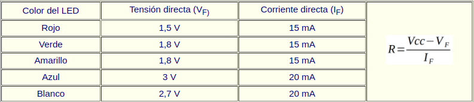
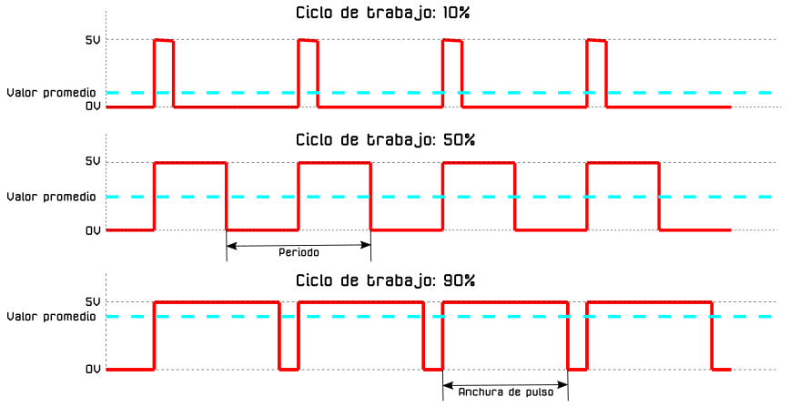
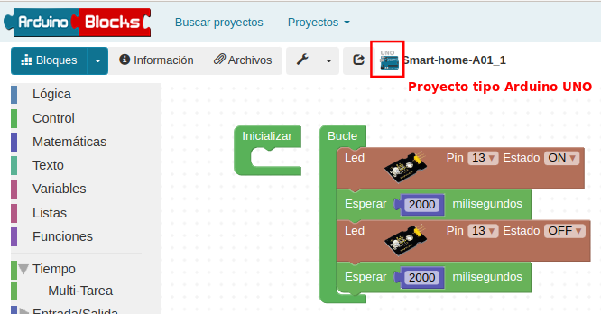
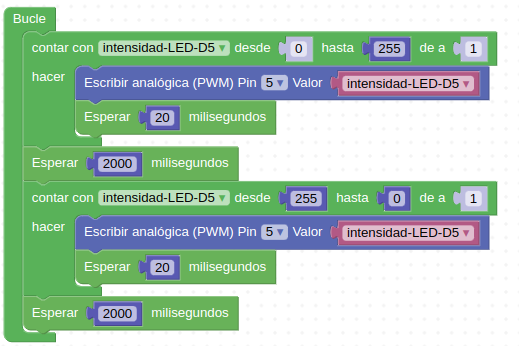

# 3.2. A01-Diodos LED

### Teoria sobre LEDs
El diodo LED (Light Emitting Diode) es un diodo semiconductor capaz de emitir luz, lo mas usuales dentro del espectro visible aunque también pueden ser de infrarrojos, laser, etc. Su uso mas habitual es como indicador y, últimamente cada vez mas frecuentes en iluminación. Sus principales ventajas frente a luces incandescentes son:

* Menor consumo de energía
* Mayor vida útil
* Menor tamaño
* Gran durabilidad y fiabilidad
* En la imagen siguiente vemos el aspecto físico que tiene y su símbolo electrónico.

| Aspecto y símbolo del LED |
|:|
|  |

El color de la cápsula es simplemente orientativo de la longitud de onda que define realmente el color de la luz emitida. Por ello el LED con la cápsula transparente puede emitir en cualquiera de los colores del espectro visible.

El LED es un dispositivo que tiene polaridad siendo su comportamiento el siguiente: En polarización directa (ánodo a positivo y cátodo a negativo) el LED emite luz y en polarización inversa (ánodo negativo y cátodo positivo) se comporta prácticamente como un interruptor abierto.

Para su correcto funcionamiento el diodo LED se polariza poniéndole en serie una resistencia que limita la corriente que pasa a través del mismo y, por tanto, determina el nivel de brillo de la luz emitida.

Sin entrar en detalles en la tabla siguiente se dan los valores de tensión directa (VF) y corriente directa (IF) para los colores mas habituales de LEDs. A partir de estos valores y el valor de tensión de alimentación de nuestro LED podemos calcular el valor de la resistencia serie sin mas que aplicar la formula indicada.

| Tensión y corriente para distintos colores |
|:|
|  |

### PWM
PWM son siglas en inglés que significan Pulse Width Modulation y que lo podemos traducir a español como Modulación de ancho de pulso. Los pines PWM permiten generar una señal analógica mediante una salida digital mapeada con 8 bits, o lo que es lo mismo, valores del 0 al 255, es decir mediante una salida PWM podemos emular una señal analógica.

En realidad una placa tipo UNO no es capaz de generar una salida analógica y lo que se hace es emplear un truco que consiste en activar una salida digital durante un tiempo y el resto del tiempo del ciclo mantenerla desactivada. El valor promedio de la salida es el valor analógico. En el tipo de modulación PWM mantendremos constante la frecuencia, o lo que es lo mismo, el tiempo entre pulsos y lo que se hace es variar la anchura del pulso.

La proporción de tiempo que está encendida la señal, respecto al total del ciclo, se denomina ciclo de trabajo o Duty cycle, y generalmente se expresa en tanto por ciento. En la imagen siguiente vemos señales con distintos ciclos de trabajo.

| Distintos Duty cicle |
|:|
|  |

Es importante recordar que en una salida PWM el valor de la tensión es 5V por lo que si alimentamos un dispositivo de 3V a partir de una salida de 5V lo dañaremos de forma irreversible.

Las señales PWM emulan una señal analógica para aplicaciones como variar la luminosidad de un LED y variar la velocidad de motores de corriente continua.

La placa KS0486 Keyestudio PLUS es de tipo UNO y dispone de seis salidas PWM (D3, D5, D6, D9, D10 y D11). 

### Actividad A01_1
En esta actividad encenderemos y apagaremos cada dos segundos el led blanco que tenemos conectado al pin D13. El programa final queda como vemos en la Figura 3.2.1 y lo tenemos disponible en el enlace [Smart-home-A01_1](http://www.arduinoblocks.com/web/project/913709).

*Figura 3.2.1. Solución A01_1*

### Actividad A01_2
En esta actividad apagaremos y encenderemos de forma progresiva el LED amarillo que tenemos conectado en D5. Utilizaremos la técnica del PWM que ya viene implementada para ese pin. El programa final queda como vemos en la Figura 3.2.2 y lo tenemos disponible en el enlace [Smart-home-A01_2](http://www.arduinoblocks.com/web/project/913714).

*Figura 3.2.2. Solución A01_2*

