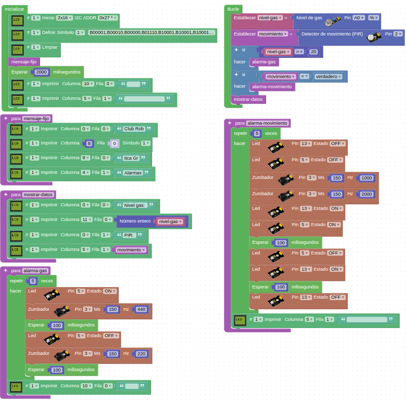

# 5.2. Reto 2 - Alarma por movimiento
Añadir al reto 1 la alarma si el sensor PIR detecta movimiento. Se muestra información en la pantalla LCD del nivel de gas detectado.

* En la Figura 5.2.1 vemos el programa en ArduinoBlocks.

*Figura 5.2.1. Solución Reto 2*

En la visualización en pantalla los valores de gas se muestran en tanto por ciento y para el sensor PIR se indica su estado lógico: '0' cuando no está activado y '1' cuando está activado.

* Si preferimos descargar el proyecto a nuestro ordenador, desde el archivo [Smart-home-Reto2.abp](../img/5/Smart-home-Reto2.abp) podemos hacerlo para posteriormente importarlo. 
