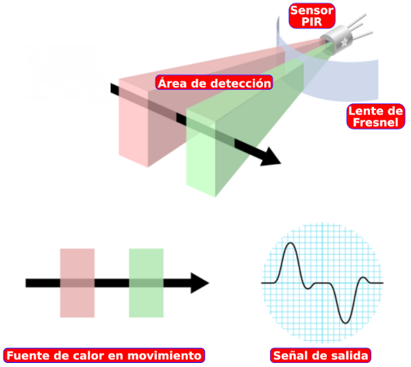
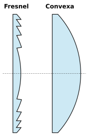
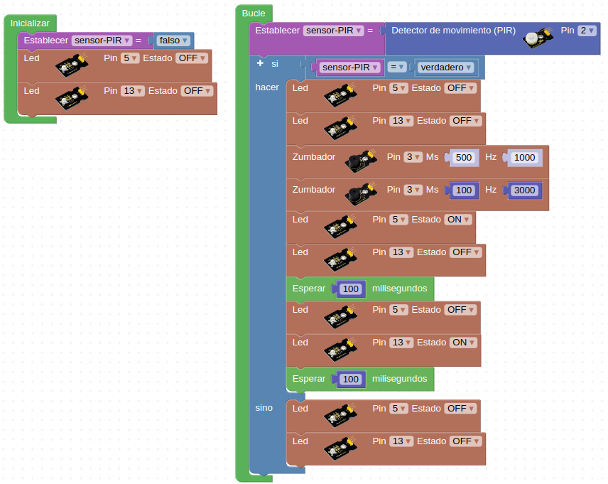

# 3.10. A09-Sensor de movimiento PIR
## Teoría3.11. A10-Sensor de gas MQ-2
Los detectores PIR (del ingés Passive Infrared), se caracterizan por su reducido tamaño, bajo costo, no ser influenciados por la luz natural, tener un bajo consumo de energía y ser de muy fácil manejo. Reaccionan sólo ante determinadas fuentes de energía tales como la generada por el calor del cuerpo humano o de los animales. Basan su funcionamiento en que todos los cuerpos (especialmente los vivos) emiten una cierta cantidad de energía infrarroja, mayor cuanto mayor es su temperatura que la capta un sensor piro eléctrico y la convierte en una señal eléctrica.

Los detectores PIR son dispositivos que detectan variaciones de la radiación infrarroja en su área de cobertura, por lo que son especialmente útiles para detectar la presencia de personas o animales a través del calor que emiten sus cuerpos.

Aunque en el enunciado del apartado pone "Sensor de movimiento PIR", el concepto PIR es solamente uno de los métodos posibles de detección de movimiento, pero es el que nos ocupa y en proyectos con placas tipo Arduino es muy común asociar ambos conceptos.

Los sensores PIR son mas complicados de explicar que la mayoría de sensores (fotocélulas, sensores de golpe, etc) porque hay muchas variables que afectan a la entrada y salida del sensor. Para explicar de forma sencilla como trabaja el sensor nos vamos a basar en el diagrama de la Figura 3.10.1

*Figura 3.10.1. Explicación sensor PIR*

El sensor PIR en sí tiene dos ranuras, cada ranura está hecha de un material especial que es sensible a los infrarrojos. La lente utilizada aquí realmente no está haciendo mucho, por lo que vemos que las dos ranuras pueden 'ver' más allá de cierta distancia (básicamente, la sensibilidad del sensor).

Cuando el sensor está inactivo, ambas ranuras detectan la misma cantidad de infrarrojos, la cantidad ambiental radiada desde la habitación, las paredes o el exterior. Cuando pasa un cuerpo caliente como por ejemplo una persona o un animal, primero intercepta la mitad del sensor PIR, lo que provoca un cambio diferencial positivo entre las dos mitades. Cuando el cuerpo caliente sale del área de detección, ocurre lo contrario, por lo que el sensor genera un cambio diferencial negativo. Estos pulsos de cambio son lo que se detectan.

El sensor IR en sí está dentro de una caja metálica sellada herméticamente para mejorar la inmunidad al ruido/temperatura/humedad. Esta caja dispone de una ventana hecha de material transmisor de infrarrojos (típicamente silicona recubierta) que protege el elemento sensor con los dos sensores equilibrados.

La mayor parte de la verdadera magia ocurre con la óptica, una lente de Fresnel que permite cambiar la amplitud, el rango y el patrón de detección muy fácilmente. Según la [Wikipedia](https://es.wikipedia.org/wiki/Lente_de_Fresnel) es un diseño que permite construir lentes de gran apertura y distancia focal corta con materiales ligeros y económicos. En la Figura 3.10.2 vemos un corte transversal de una lente de Fresnel comparada con una plano-convexa tradicional.

*Figura 3.10.2. Lentes de Fresnel y convexa*

En la Figura 3.10.3 vemos gráficamente el funcionamiento del sistema y como la lente Fresnel condensa la radiación infrarroja al sensor.

*Figura 3.10.3. Funcionamiento de una lente Fresnel*

Explicación del funcionamiento basada en en el documento de [Adafruit](https://www.adafruit.com/) titulado [PIR Motion Sensor - Created by lady ada](https://cdn-learn.adafruit.com/downloads/pdf/pir-passive-infrared-proximity-motion-sensor.pdf)

En la Figura 3.10.4 vemos la ventan del sensor PIR en el módulo que incorpora la Smart home.

*Figura 3.10.4. Ventana del sensor PIR en el módulo de Keyestudio*

Las características del módulo de keyestudio son:

* Tensión de alimentación: de 3.3 a 18V DC
* Consumo 15 uA
* Temperatura de trabajo: de -20 a 85 ºC
* Salidas: 3V = nivel alto y 0V = nivel bajo
* Tiempo de retardo en la salida para el nivel alto: 2.3 a 3 segundos
* Ángulo de detección: 100º
* Distancia de detección: 3 a 4 metros
* LED indicador: Si la salida está en nivel alto el LED se enciende

Algunas aclaraciones que nos hace el fabricante:

1. La distancia máxima es de 3-4 metros.
2. Antes de probar la primera vez quitamos la lente blanca, se puede ver la ventana de detección rectangular. Cuando el lado mayor del rectángulo es paralelo al suelo, la distancia es la mejor.
3. Para comenzar a probar el sensor debe cubrirse con la lente blanca; de lo contrario, afectará a la distancia.
4. La distancia de detección óptima se da a 25 ℃ y se acorta cuando supera los 30 ℃.
5. Cuando carguemos nuestro código debemos esperar entre 5 a 10 segundos para que el módulo sea sensible y luego comenzar a probar.

### Actividad A09_1
En esta actividad vamos a hacer que cuando el sensor PIR (pin 2) detecte una presencia suene una alarma acústica en el zumbador (pin 3) y que alternativamente parpadeen los diodos LED amarillo (pin 5) y blanco (pin 13). La solución la tenemos disponible en [Smart-home-A09_1](http://www.arduinoblocks.com/web/project/915382).

*Figura 3.10.5. Solución A09_1*

