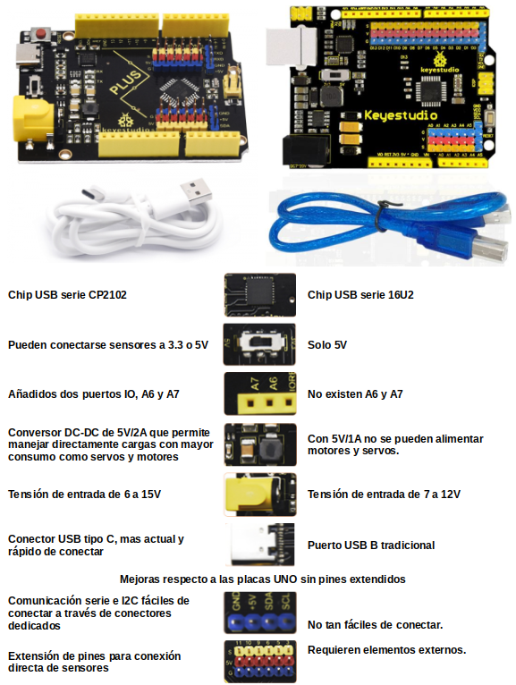
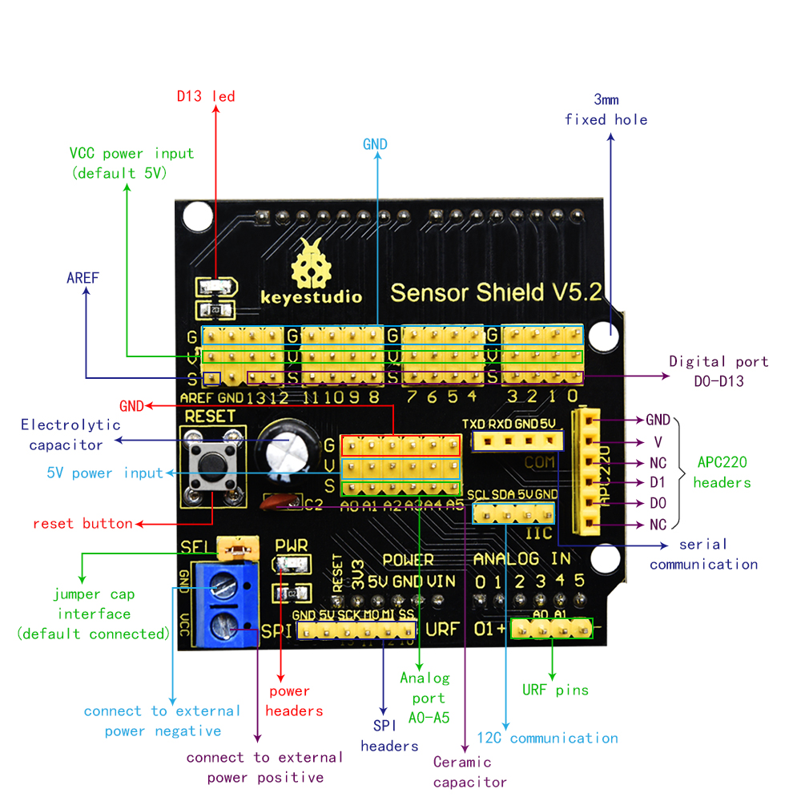

# 2.3. Placas KS0486 PLUS y Ks0004 Sensor Shield V5.2

## **2.3.1. Placa de desarrollo KS0486 Keyestudio PLUS**
Esta placa de control es totalmente compatible y contiene todas las funciones de las placas tipo Arduino UNO R3. Además, dispone de las mejoras que vemos en la comparativa siguiente. Para estar actualizada la placa se ha equipado con un cable USB de 1 m con interfaz tipo C.

*Comparativa*

## **2.3.2. Placa Ks0004 Keyestudio Sensor Shield V5**
Esta placa amplia los puertos digitales y analógicos con interfaz de 3 pines (G, V, S) a los que se pueden conectar directamente módulos sensores de 3 pines. También integra pines de comunicación serie, IIC y SPI. También lleva un botón de reinicio y 2 LEDs indicadores.

Además, se le puede suministrar el voltaje necesario para módulos que lo requieran a través de la clema azul.

En la imagen siguiente vemos el pinout de la placa.

*[Pinout. Obtenido de](https://wiki.keyestudio.com/Ks0004_keyestudio_Sensor_Shield_V5)*

