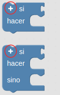

# 3.4. A03-Pulsador
## Teoría
En la tabla siguiente vemos la simbología y algunos ejemplos del aspecto físico de estos elementos.

| Símbolos y aspecto real de un pulsador |
|:|
|  |

Se trata de un dispositivo que es capaz de abrir o cerrar el paso de la corriente eléctrica mientras permanece accionado, es decir, su función no queda anclada como por ejemplo en los interruptores de la luz de casa, en donde el accionamiento permanece hasta que no se vuelve a accionar. En un pulsador, por contra, su activación dura mientras lo mantenemos pulsado y vuelve a su estado de reposo en cuanto dejemos de pulsarlo.

Mediante la configuración adecuada podemos convertir un pulsador en un elemento de entrada a algún pin de nuestra placa UNO. Las configuraciones más básicas posibles con pulsadores las podemos ver en la imagen siguiente.

| Configuración circuito elemental con pulsador |
|:|
|  |

## Concepto de variable y de contador
El concepto de variable en programación consiste simplemente en asignarle un nombre significativo a un espacio de memoria donde almacenar determinada información durante la ejecución normal del programa. El concepto es muy amplio y complejo y en nuestro caso no vamos a entrar en detalles sobre el mismo, pero si indicar que no se debe confundir con el concepto de variable matemática, ya que una expresión como x = x + 1 que es una aberración en matemáticas tiene todo el sentido en programación. Lógicamente en matemáticas no se puede cumplir pero en programación significa que a la variable x se le sume uno y el resultado se vuelva a guardar en la misma variable.

En ArduinoBlocks podemos crear tres tipos de variables, numéricas, de texto o booleanas. En la animación siguiente podemos ver como se pueden crear, eliminar y renombrar variables.

En programación, llamamos contador a una variable cuyo valor se incrementa o decrementa en un valor fijo para cada iteración del bucle para el que se ha definido. El uso habitual de un contador es simplemente contar el número de veces que itera un bucle en general o de forma mas extensa contar, solamente, aquellas iteraciones en las que se cumpla una determinada condición.

Por ejemplo, supongamos que tenemos una variable de nombre Estado de valor inicial cero y que se incremente cada vez que accionamos un pulsador, de esta forma si en un bucle vamos incrementando la variable de uno en uno, tenemos:

<B><BLOCKQUOTE> Estado = 0 // valor inicial

Estado = 1 // Estado = Estado + 1

Estado = 2 // Estado = Estado + 1

... </BLOCKQUOTE></B>

## Condicionales
Las sentencias condicionales son aquellas que nos permiten tomar decisiones en función de si ocurre o no ocurre determinada cosa. En el caso de ArduinoBlocks estas las podemos encontrar en el bloque lógica. Este bloque contiene los elementos que vemos en la imagen siguiente:

| Bloque lógica |
|:|
|  |

El funcionamiento es el siguiente: se evalúa la condición que ponemos en "si" y si el resultado es verdadero, o sea condición cierta, se realizan las acciones que pongamos en "hacer" y si no es cierta dichas acciones no se realizan. En el apartado condición se pueden poner infinidad de factores como pueden ser el estado de sensores, realizar comparaciones, hacer operaciones matemáticas, etc. Lógicamente el resultado de evaluar la condición debe ser verdadero o falso lo que se resuelve en el caso de la programación en Arduino diciendo que si el resultado es 0, el resultado de la evaluciación es falso y si es 1 o cualquier otro valor es verdero.

Si hemos sido observadores hemos visto en los bloques "si" de "Lógica" un signo mas (+) en la parte superior izquierda tanto del condicional "if" como la del "if ... else" tal y como se destaca en la imagen siguiente.

| Añadir opciones else if |
|:|
|  |

Cada vez que pulsemos sobre el signo mas se añadirá una cláusula "else if" a la principal y podemos añadir tantas como necesitemos. Esta cláusula nos va a permitir establecer una nueva condición.En la imagen siguiente vemos añadidas dos para el caso de "if ... else". En la imagen observamos el código equivalente y las distintas condiciones que se pueden establecer.

| Clausula if...else con dos else if |
|:|
|  |

El signo menos (-) que aparece en la imagen sirve para eliminar la correspondiente cláusula "else if".

### Actividad A03_1
En esta actividad haremos un sencillo programa que encienda el LED amarillo (D5) cuando pulsemos el pulsador de la izquierda (D4). En la Figura 3.4.1 vemos el programa completo. La solución la tenemos disponible en [Smart-home-A03_1](http://www.arduinoblocks.com/web/project/914067).

*Figura 3.4.1. Solución A03_1*

### Actividad A03_2
En esta actividad haremos el mismo programa que en la anterior, pero utilizando la clausula else. En la Figura 3.4.2 vemos el programa completo. La solución la tenemos disponible en [Smart-home-A03_2](http://www.arduinoblocks.com/web/project/914081).

*Figura 3.4.2. Solución A03_2*

### Actividad A03_3
Resolver la actividad A03_2 de forma que el funcionamiento sea al contrario, es decir, que el LED amarillo esté siempre encendido y al accionar el pulsador izquierdo se apague. La solución la tenemos disponible en [Smart-home-A03_3](http://www.arduinoblocks.com/web/project/914101).

*Figura 3.4.3. Solución A03_3*

### Actividad A03_4
Hacer un programa que al accionar el pulsador izquierdo se encienda el LED amarillo y que al accionar el pulsador derecho (8) se apague. Como ampliación se sugiere modificar el programa para que encienda y apague los dos LEDs blanco y amarillo a un tiempo o de forma alternada. La solución la tenemos disponible en [Smart-home-A03_4](http://www.arduinoblocks.com/web/project/914126). La solución en esta ocasión está en utilizar el operador NOT y el operador AND. Para obtener mas información sobre [operadores lógicos](https://fgcoca.github.io/TdR-STEAM-and_UNO/operadores/) podemos ir al enlace.

*Figura 3.4.4. Solución A03_4*

### Actividad A03_5
Hacer un programa que emita, usando uno de los pulsadores como si fuese un telégrafo, el código Morse universal de solicitud de socorro, SOS.

El alfabeto Morse lo vemos en la Figura 3.4.5, donde podemos observar que la S son tres puntos o pulsaciones cortas y la O son tres rayas o pulsaciones largas. Sin entrar en mas detalles daremos la solución considerando SOS como una palabra (es lo universalmente adoptado) de forma que no haremos pausas entre letras.

*Figura 3.4.5. Alfabeto Morse*

La solución la tenemos disponible en [Smart-home-A03_5](http://www.arduinoblocks.com/web/project/914128).

*Figura 3.4.6. Solución A03_5*

### Actividad A03_6
Hacer un programa que al accionar el pulsador izquierdo encienda el LED amarillo y que este permanezca encendido hasta que no accionemos el mismo pulsador dos veces mas (3 pulsaciones en total), en cuyo caso se apagará. La solución la tenemos disponible en [Smart-home-A03_6](http://www.arduinoblocks.com/web/project/914130).

*Figura 3.4.7. Solución A03_6*

