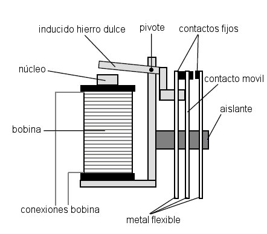
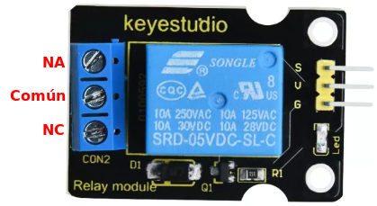
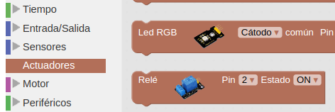
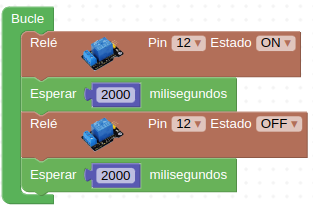
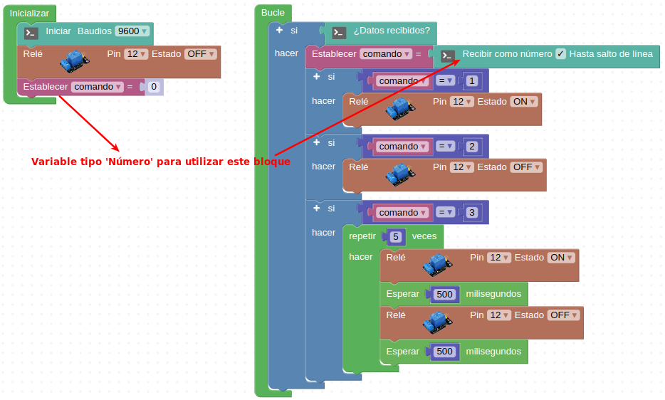
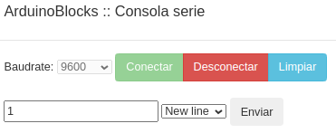

# 3.5. A04-Relés
## Teoría
Un relé es básicamente un interruptor mecánico controlado eléctricamente de forma que a través de una pequeña tensión y corriente se puede controlar la apertura y cierre de sus contactos mecánicos donde se puede trabajar con tensiones y corrientes elevadas.
El módulo incluye un LED que nos indica si el relé está accionado cuando se enciende.
El modelo de relé que lleva este módulo es el SRD-05VDC-SL-C que presenta las siguientes características:

* En AC (corriente alterna): 250Vac / 10A
* En DC (corriente continua): 30Vdc / 10A o bien 250Vdc / 1A
* Tensión de la bobina: 5V, compatible con señales TTL para su excitación
* Contactos: 3 pines, 1 Común + 1 contacto NA (normalmente abierto) + 1 contacto NC (normalmente cerrado).

Esquemáticamente un relé de este tipo se puede parecer a la imagen siguiente:

| Un relé esquematizado |
|:|
|  |
| *Fuente: [wikipedia](https://es.wikipedia.org/wiki/Relé)* |

En el enlace a wikipedia podemos ver una animación del [funcionamiento de un relé](https://es.wikipedia.org/wiki/Relé#/media/Archivo:Relay_principle_horizontal_new.gif).

Su aspecto es:

| Aspecto real del módulo relé |
|:|
|  |

En el apartado de bloques de programación, se encuentra en "Actuadores".

| Aspecto real del módulo relé |
|:|
|  |

En el apartado de bloques de programación, se encuentra en "Actuadores".

| Bloque de programación del módulo relé |
|:|
|  |

## **El terminal o consola serie**
Sirve para visualizar en un ordenador los datos recibidos a través del puerto serie y en realidad es una aplicación que controla las comunicaciones bidireccionales a través de la UART integrada en el microcontrolador.

Es muy importante tener siempre presente que el puerto serie es el que se utiliza para "subir" el firmware o programa a la placa, tarea que se realiza a través de una aplicación pregrabada en el microntrolador y que se denomina "bootloader".

En ArduinoBlocks es posible usar la consola serie solamente si tenemos instalada y en funcionamiento la aplicación [ArduinoBlocks-Connector](http://www.arduinoblocks.com/web/site/abconnector5) que es la encargada de establecer las comunicaciones locales de nuestra placa con las remotas de la aplicación. En la imagen siguiente vemos el aspecto de la consola.

| Aspecto de la Consola en ArduinoBlocks |
|:|
|  |

A la hora de establecer una conexión serie los dos extremos que intervienen en la conexión (placa UNO y ordenador) deben establecer el mismo valor en la velocidad de la conexión. Por defecto esta velocidad es de 9600 baudios o bits por segundo y otras velocidades comunmente utilizadas son: 4800, 19200, 38400, 57600, 115200. Es por lo tanto imprescindible incluir en el bloque "Inicializar" el bloque "Iniciar" y establecer la velocidad de comunicación.

## **Serial Plotter - Datalogger**
Es otra funcionalidad relacionada con la comunicación serie que nos permite visualizar información en forma de gráfica en tiempo real. Además el “Serial Plotter” implementa un sencillo datalogger con el que podemos ir grabando los datos para exportarlos posteriormente. En ArduinoBlocks existen bloques que nos permiten trabajar con el serial plotter. El serial plotter + datalogger se activa haciendo clic en la flecha a la derecha de Consola y tiene el aspecto que vemos en la imagen siguiente:

| Serial Plotter + Datalogger |
|:|
|  |

## **Mapeo**
Las entradas analógicas trabajan con 10 bits, o sea valores comprendidos entre 0 y 1023 y también que la salidas digitales trabajan con 8 bits, o sea valores entre 0 y 255, por lo que si queremos combinar en nuestro programa entradas analógicas con salidas digitales debemos realizar un ajuste de escala en los datos. A este ajuste se le conoce como "mapear" y es un bloque disponible en el menú Matemáticas con el aspecto de la imagen siguiente:

| Bloque mapear |
|:|
|  |

Este bloque permite modificar un valor o variable desde un rango origen a un rango destino. Esta función es especialmente útil para adaptar los valores leídos de sensores o para adaptar valores a aplicar en un actuador.

### Actividad A04_1
Esta actividad va a consistir sencillamente en activar y desactivar el relé lo que originará un cambio en la posición de sus contactos. La forma de visualizar que funciona puede ser colocar un diodo LED entre el común y uno de los contactos, medir continuidad con un polímetro o colocar en los contactos cualquier otro elemento que nos permita observar que el relé cambia de estado. Si prestamos atención podemos escuchar actuar los contactos. La solución la tenemos disponible en [Smart-home-A04_1](../programas/Smart-home-A04_1.abp).

*Figura 3.5.1. Solución A04_1*

### Actividad A04_2
Vamos a controlar el accionamiento de un relé desde nuestro ordenador a través de la consola serie utilizando los siguientes comandos, que enviaremos desde la consola: 1 –> ON, 2 –> OFF y 3 –> Conmutar ON/OFF a 500 ms. La solución la tenemos disponible en [Smart-home-A04_2](../programas/Smart-home-A04_2.abp).

*Figura 3.5.2. Solución A04_2*

El aspecto de la consola lista para enviar el comando de encendido lo vemos en la Figura 3.5.3.

*Figura 3.5.3. Aspecto de la consola lista para enviar el comando 1*

