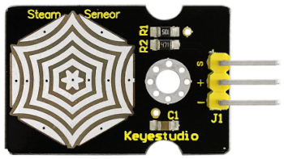
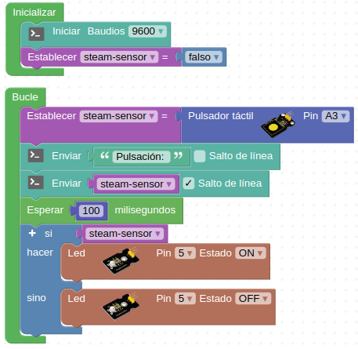
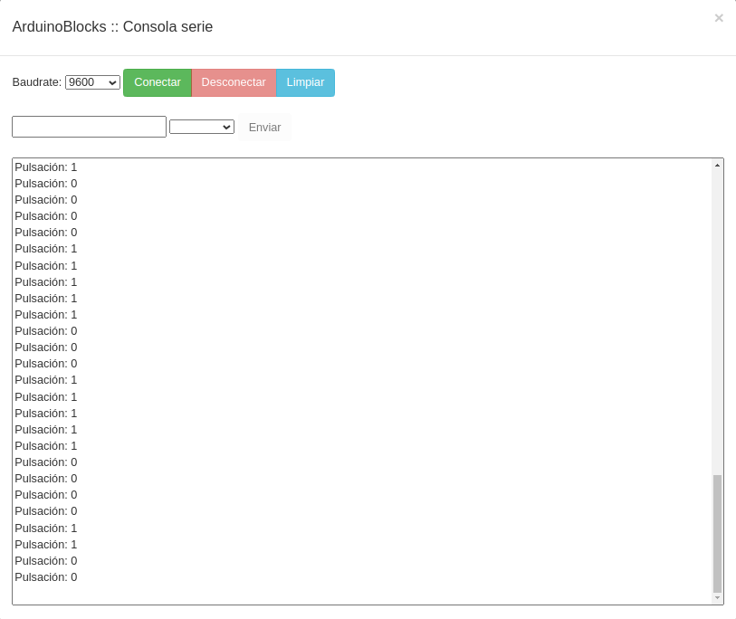
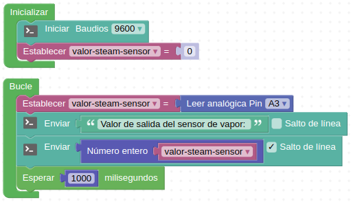
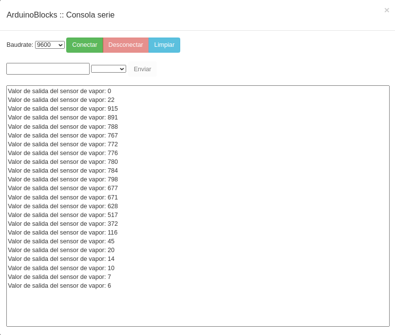

# 3.9. A08-Sensor de vapor (steam)
## Teoría
El sensor de vapor es un sensor analógico y puede utilizarse como un simple detector de agua de lluvia, interruptor de nivel de líquido e incluso como sensor táctil. Cuando aumenta la humedad en la superficie del sensor, aumenta el voltaje en su salida.

En la Figura 3.9.1 vemos el aspecto que tiene este dispositivo.

*Figura 3.9.1. Aspecto del sensor de vapor (steam)*

Precaución: las piezas de conexión no son impermeables, luego no debemos sumergirlo en agua

Su principio de funcionamiento se base en detectar la cantidad de agua mediante pistas paralelas de la PCB que están estañadas pero expuestas. Cuanta más agua haya, más cables se conectarán entre si. El sensor es capaz de detectar vapor de agua y se puede utilizar como sensor de lluvia.

Sus principales especificaciones son:

* Voltaje de funcionamiento: 3,3 V o 5 V.
* Consumo: <20mA
* Rango de temperatura de trabajo: －10 ℃ a ＋ 70 ℃
* Tipo de salida: señal analógica
* S: señal de salida analógica 
* +: Alimentación positiva (VCC)
* -： Alimentación negativa o masa (GND)

### Actividad A08_1
En esta actividad controlaremos el diodo LED amarillo conectado al pin D5 utilizando el sensor de vapor conectado al pin A3 como sensor táctil. Utilizaremos el monitor serie para ver el estado de la variable creada. La solución la tenemos disponible en [Smart-home-A08_1](http://www.arduinoblocks.com/web/project/915164).

*Figura 3.9.2. Solución A08_1*

En la Figura 3.9.3 vemos el efecto en la consola de activar o no el sensor.

*Figura 3.9.3. Consola A08_1*

### Actividad A08_1
En esta actividad vamos a leer directamente el valor entregado por el sensor de vapor conectado al pin A3. Utilizaremos el monitor serie para ver el resultado. La solución la tenemos disponible en [Smart-home-A08_2](http://www.arduinoblocks.com/web/project/915182).

*Figura 3.9.4. Solución A08_2*

En la Figura 3.9.5 vemos el resultado de humedecer el sensor en la consola serie.

*Figura 3.9.5. Consola A08_2*

