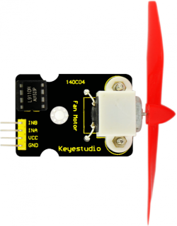
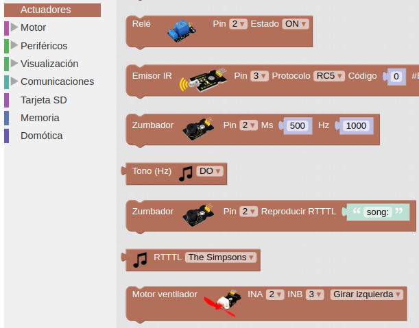
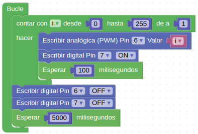
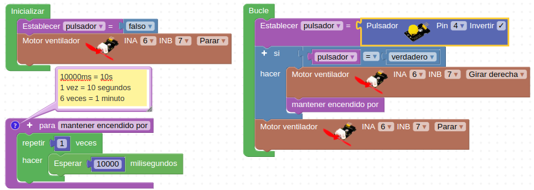

# 3.8. A07-Módulo ventilador
## Teoría
El módulo se componen de un motor de corriente continua a cuyo eje se puede aplicar una pequeña hélice que se puede usar como mini ventilador o como hélice en si misma. El módulo incorpora el controlador L9110 que es un puente en H que permite seleccionar el sentido de giro.

Su aspecto es el de la Figura 3.8.1.

*Figura 3.8.1. Aspecto del módulo ventilador*

A diferencia de otros controladores o drivers como el L293D y el L298N, este solo utiliza una fuente, que será la misma para alimentación y control. Otra diferencia importante es que para controlar la velocidad no poseé una entrada especifica.

En el apartado de bloques de programación, se encuentra en "Actuadores", tal y como apreciamos en la Figura 3.8.2.

*Figura 3.8.2. Bloque motor ventilador*

### Actividad A07_1
En esta actividad controlaremos el ventilador que está conectado en los pines D6 y D7. Utilizaremos el pin D6 para regular la velocidad del motor y el pin D7 cuando está apagado o encendido. La solución la tenemos disponible en [Smart-home-A07_1](../programas/Smart-home-A07_1.abp).

*Figura 3.8.3. Solución A07_1*

### Actividad A07_2
En esta actividad accionaremos el ventilador mediante uno de los pulsadores y se mantendrá en funcionamiento el tiempo que prefijemos en el programa. La solución la tenemos disponible en [Smart-home-A07_2](../programas/Smart-home-A07_2.abp).

*Figura 3.8.4. Solución A07_2*

